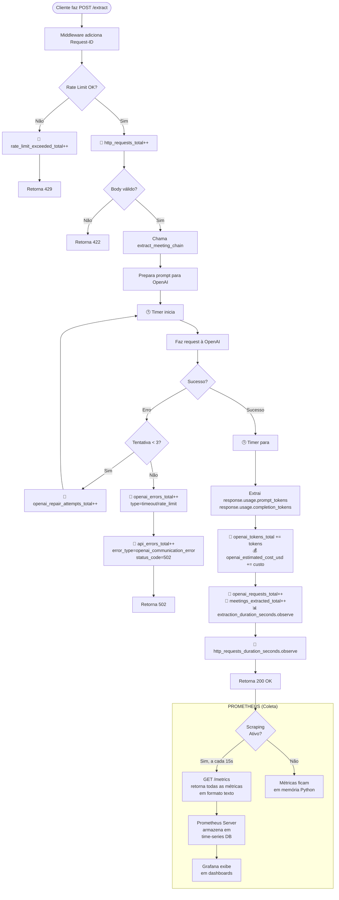

# 📊 Monitoramento com Prometheus (Métricas)

## 🎯 Visão Geral e Objetivo

Este documento detalha a implementação de um sistema de monitoramento de métricas utilizando **Prometheus**. O objetivo é obter visibilidade sobre a performance, custos, e saúde operacional do microserviço de extração.

As métricas nos permitem:
- **Monitorar Custos:** Acompanhar o consumo de tokens e o custo estimado com a API da OpenAI.
- **Identificar Erros:** Rastrear a quantidade e os tipos de erros (ex: falhas na API, retentativas, timeouts).
- **Analisar Performance:** Medir a latência das extrações e o tempo de resposta da API.
- **Entender o Uso:** Observar a quantidade de requisições, tipos de reuniões e fontes de dados.

---

## 🛠️ Arquitetura e Tecnologias

### 1. Tecnologias Envolvidas

| Componente | Tecnologia | Função |
|---|---|---|
| **Aplicação** | FastAPI + Python | A API que processa as requisições de extração. |
| **Instrumentação**| `prometheus-client` | Biblioteca Python que coleta e expõe as métricas. |
| **Endpoint** | `GET /metrics` | Rota na API que exibe as métricas em formato de texto. |
| **Coleta** | Prometheus Server | (Opcional, Futuro) Ferramenta que lê e armazena o histórico das métricas. |
| **Visualização** | Grafana | (Opcional, Futuro) Ferramenta para criar dashboards e gráficos. |

### 2. Onde os Dados São Armazenados

> **Escopo da Fase 3:** As métricas serão armazenadas **em memória** dentro da própria aplicação. Se a API for reiniciada, os dados são perdidos. Isto é ideal para desenvolvimento e observação em tempo real.

```
┌─────────────────────────────────────────────────────────────┐
│ FASE 3 (O QUE VAMOS IMPLEMENTAR)                            │
├─────────────────────────────────────────────────────────────┤
│                                                             │
│ 📍 Armazenamento IN-MEMORY (dentro da API)                  │
│   - Métricas existem como variáveis Python na RAM.          │
│   - Expostas em tempo real via endpoint GET /metrics.       │
│   - ⚠️ Dados SÃO PERDIDOS se a API reiniciar.               │
│                                                             │
└─────────────────────────────────────────────────────────────┘
```

> **Setup de Produção (Futuro):** Para persistência, um **Prometheus Server** é configurado para "raspar" (fazer scraping) o endpoint `/metrics` periodicamente, salvando os dados em um banco de dados de séries temporais.

```
┌─────────────────────────────────────────────────────────────┐
│ PRODUÇÃO (SETUP COMPLETO - FUTURO)                          │
├─────────────────────────────────────────────────────────────┤
│                                                             │
│ 📍 Prometheus Server (Time-Series Database)                 │
│   - Faz scraping do endpoint GET /metrics a cada X segundos.│
│   - Armazena o histórico em disco.                          │
│   - Permite consultas (PromQL), alertas e dashboards.       │
│   - 🎯 Dados PERSISTEM mesmo que a API reinicie.            │
│                                                             │
└─────────────────────────────────────────────────────────────┘
```

---

## 📈 Métricas Coletadas (As 12 Métricas)

A tabela abaixo detalha todas as métricas implementadas, incluindo onde são coletadas e como são calculadas.

### 🤖 Métricas da OpenAI API

| Métrica | Tipo | Descrição | Labels | Localização | Como é Calculada |
|---|---|---|---|---|---|
| `openai_requests_total` | Counter | Total de requisições à OpenAI | `model`, `status` | `extractor.py` | +1 a cada chamada `chain.ainvoke()` (sucesso/erro) |
| `openai_errors_total` | Counter | Erros específicos da OpenAI | `error_type` | `extractor.py` | +1 quando `RateLimitError`, `APITimeoutError`, `APIError` |
| `openai_tokens_total` | Counter | Tokens processados pela OpenAI | `type` | `extractor.py` | Soma de `prompt_tokens`, `completion_tokens`, `total_tokens` |
| `openai_estimated_cost_usd` | Counter | Custo estimado em USD | `model` | `extractor.py` | `(prompt_tokens/1M × $5) + (completion_tokens/1M × $15)` |
| `openai_repair_attempts_total` | Counter | Tentativas de reparo de JSON | `status` | `extractor.py` | +1 quando `_repair_json()` é chamado (success/failed) |

### ⚡ Métricas de Extração e Performance

| Métrica | Tipo | Descrição | Labels | Localização | Como é Calculada |
|---|---|---|---|---|---|
| `extraction_duration_seconds` | Histogram | Tempo de duração da extração | - | `main.py` | `time.time()` antes/depois de `extract_meeting_chain()` |
| `meetings_extracted_total` | Counter | Reuniões extraídas com sucesso | `source` | `main.py` | +1 quando extração completa (raw_meeting/transcript) |
| `meetings_by_type_total` | Counter | Reuniões por tipo | `meeting_type` | `main.py` | +1 usando `extracted.meeting_type` ou "Unknown" |
| `transcript_size_bytes` | Histogram | Tamanho das transcrições | - | `main.py` | `len(normalized.transcript.encode('utf-8'))` |

### 🌐 Métricas HTTP e Rate Limiting

| Métrica | Tipo | Descrição | Labels | Localização | Como é Calculada |
|---|---|---|---|---|---|
| `rate_limit_exceeded_total` | Counter | Rate limits excedidos | `endpoint` | `main.py` | +1 no handler `RateLimitExceeded` |
| `api_errors_total` | Counter | Erros retornados pela API (502, 500) | `error_type`, `status_code` | `main.py` | +1 nos exception handlers (502/500) |
| `http_requests_total` | Counter | Requisições HTTP recebidas | `method`, `endpoint`, `status_code` | `main.py` (middleware) | +1 para cada requisição HTTP (sucesso/erro) |
| `http_requests_duration_seconds` | Histogram | Latência das requisições HTTP | `method`, `endpoint` | `main.py` (middleware) | Timer no middleware para todas as rotas |

---

## 🔄 Fluxo de Coleta de Métricas

O fluxograma abaixo ilustra quando e como cada métrica é coletada durante o ciclo de vida de uma requisição `POST /extract`.



---

## 🔧 Detalhes Técnicos da Implementação

### Arquivos Envolvidos

| Arquivo | Responsabilidade | Métricas Coletadas |
|---|---|---|
| `app/metrics/collectors.py` | **Definição das métricas** e funções auxiliares | Todas as 13 métricas (definição) |
| `app/main.py` | **Instrumentação HTTP** e fluxo principal | `rate_limit_exceeded_total`, `api_errors_total`, `http_requests_total`, `extraction_duration_seconds`, `meetings_extracted_total`, `meetings_by_type_total`, `transcript_size_bytes`, `http_requests_duration_seconds` |
| `app/extractors/extractor.py` | **Instrumentação OpenAI** | `openai_requests_total`, `openai_errors_total`, `openai_tokens_total`, `openai_estimated_cost_usd`, `openai_repair_attempts_total` |
| **FastAPI Instrumentator** | **Métricas HTTP automáticas** | Métricas adicionais do Prometheus (opcional) |

### Pontos de Coleta Específicos

#### 📍 Em `main.py` - Middleware `add_request_id_and_metrics()`

```python
# Linha ~205: Registra todas as requisições HTTP
record_http_request(
    method=request.method,
    endpoint=request.url.path,
    status_code=response.status_code
)

# Linha ~210: Registra duração de todas as requisições
record_http_duration(
    method=request.method,
    endpoint=request.url.path,
    duration=time.time() - start_time
)
```

#### 📍 Em `main.py` - Exception Handlers

```python
# Handler de erros 502/500: Registra métrica de erro da API
record_api_error("openai_communication_error", 502)  # Para erros OpenAI
record_api_error("openai_invalid_response", 502)     # Para dados inválidos
record_api_error("internal_error", 500)              # Para erros internos
```

#### 📍 Em `main.py` - Função `extract_meeting()`

```python
# Linha ~460: Timer HTTP iniciado
http_start_time = time.time()

# Linha ~487: Tamanho da transcrição
transcript_size = len(normalized.transcript.encode('utf-8'))
record_transcript_size(transcript_size)

# Linha ~511: Timer de extração iniciado
extraction_start = time.time()
extracted = await extract_meeting_chain(...)

# Linha ~520: Duração da extração registrada
extraction_duration = time.time() - extraction_start
extraction_duration_seconds.observe(extraction_duration)

# Linha ~538: Reunião extraída registrada
source = "raw_meeting" if body.raw_meeting else "transcript"
meeting_type = extracted.meeting_type or "Unknown"
record_meeting_extracted(source, meeting_type)

# Linha ~542: Duração HTTP total registrada
http_duration = time.time() - http_start_time
record_http_duration("POST", "/extract", http_duration)
```

#### 📍 Em `main.py` - Handler `rate_limit_exception_handler()`

```python
# Linha ~270: Rate limit excedido
endpoint = request.url.path
record_rate_limit_exceeded(endpoint)
```

#### 📍 Em `extractor.py` - Função `extract_meeting_chain()`

```python
# Linha ~366: Sucesso da OpenAI
model = get_model_from_env()
record_openai_request(model, "success")

# Linha ~370-400: Extração de tokens (múltiplos métodos)
# Método 1: response_metadata
if hasattr(result, 'response_metadata') and result.response_metadata:
    usage = result.response_metadata.get('token_usage')
# Método 2: usage direto
elif hasattr(result, 'usage') and result.usage:
    usage = result.usage
# Método 3: response.usage (se disponível)
elif hasattr(result, 'response') and hasattr(result.response, 'usage'):
    usage = result.response.usage

if usage:
    record_openai_tokens(model, prompt_tokens, completion_tokens, total_tokens)

# Linha ~379: Erro da OpenAI
record_openai_request(model, "error")
record_openai_error(type(e).__name__)

# Linha ~425: Reparo bem-sucedido
record_repair_attempt("success")

# Linha ~434: Reparo falhado
record_repair_attempt("failed")
```

### Cálculos Específicos

#### 💰 Custo da OpenAI (`openai_estimated_cost_usd`)

```python
def calculate_openai_cost(model: str, prompt_tokens: int, completion_tokens: int) -> float:
    pricing = {
        "gpt-4o": {"input": 5.00, "output": 15.00},      # $/1M tokens
        "gpt-4o-mini": {"input": 0.15, "output": 0.60},
        "gpt-3.5-turbo": {"input": 0.50, "output": 1.50}
    }
    
    model_pricing = pricing.get(model, pricing["gpt-4o"])
    input_cost = (prompt_tokens / 1_000_000) * model_pricing["input"]
    output_cost = (completion_tokens / 1_000_000) * model_pricing["output"]
    
    return input_cost + output_cost
```

**Exemplo:** Para GPT-4o com 1000 prompt tokens + 500 completion tokens:
- Input: `(1000 / 1_000_000) × $5.00 = $0.005`
- Output: `(500 / 1_000_000) × $15.00 = $0.0075`
- **Total: $0.0125**

#### 📏 Tamanho da Transcrição (`transcript_size_bytes`)

```python
# Calcula bytes UTF-8 (não caracteres)
transcript_size = len(normalized.transcript.encode('utf-8'))
```

**Diferença importante:** Caracteres especiais (acentos, emojis) ocupam mais de 1 byte em UTF-8.

#### ⏱️ Duração da Extração (`extraction_duration_seconds`)

```python
# Timer específico apenas para a chamada à OpenAI
extraction_start = time.time()
extracted = await extract_meeting_chain(normalized, request_id)
extraction_duration = time.time() - extraction_start
```

**Não inclui:** Validação Pydantic, normalização, logs. **Inclui:** Apenas o tempo de processamento do LLM.

### Configuração de Buckets dos Histogramas

#### `extraction_duration_seconds`
```python
buckets=[0.5, 1.0, 2.0, 5.0, 10.0, 30.0, 60.0, float("inf")]
```
- **0.5s-2s:** Respostas rápidas (transcrições curtas)
- **2s-10s:** Respostas normais (transcrições médias)
- **10s-30s:** Respostas lentas (transcrições longas)
- **30s+:** Casos extremos ou problemas de rede

#### `transcript_size_bytes`
```python
buckets=[1000, 5000, 10000, 25000, 50000, 100000, 250000, float("inf")]
```
- **1KB-5KB:** Reuniões curtas (5-10 min)
- **5KB-25KB:** Reuniões médias (15-30 min)
- **25KB-100KB:** Reuniões longas (45-90 min)
- **100KB+:** Reuniões muito longas (2h+)

#### `http_requests_duration_seconds`
```python
buckets=[0.1, 0.25, 0.5, 1.0, 2.5, 5.0, 10.0, float("inf")]
```
- **0.1s-0.5s:** Requisições muito rápidas (cache, validação simples)
- **0.5s-2.5s:** Requisições normais
- **2.5s-10s:** Requisições lentas (processamento complexo)
- **10s+:** Timeouts ou problemas

---

## ⚙️ Como Funciona Cada Tipo de Métrica

### 1. Counter (Contador)
É um valor que **só pode aumentar** (ou ser resetado para zero). Ideal para contar eventos, como número de requisições, erros, ou total de tokens.

```python
# Declaração (feita uma vez no início)
from prometheus_client import Counter
erros_totais = Counter('erros_totais', 'Total de erros ocorridos')

# Uso (a cada vez que um erro acontece)
erros_totais.inc()  # Incrementa o contador em 1
```

### 2. Gauge (Medidor)
Representa um valor numérico que pode **subir e descer**. Perfeito para medir valores instantâneos, como número de usuários ativos, uso de memória ou temperatura.

```python
# Declaração
from prometheus_client import Gauge
conexoes_ativas = Gauge('conexoes_ativas', 'Número de conexões ativas')

# Uso
conexoes_ativas.inc()  # +1 quando uma conexão é aberta
conexoes_ativas.dec()  # -1 quando uma conexão é fechada
```

### 3. Histogram (Histograma)
Mede a **distribuição de valores** em "baldes" (buckets) configuráveis. É a melhor forma de medir latência e tamanhos de requests. Automaticamente calcula a contagem (`_count`), a soma (`_sum`), e os buckets (`_bucket`).

Com esses dados, o Prometheus pode calcular **percentis** (ex: P95, P99), que são cruciais para entender a performance real da aplicação.

```python
# Declaração com buckets de tempo
from prometheus_client import Histogram
latencia_request = Histogram(
    'latencia_request_seconds',
    'Latência das requisições',
    buckets=[0.1, 0.5, 1, 2.5, 5, 10]  # buckets em segundos
)

# Uso
import time
start = time.time()
# ... processa a requisição ...
duration = time.time() - start
latencia_request.observe(duration)  # Ex: registra um valor de 0.78s
```

---

## 📊 Configuração dos Histogramas

Para as métricas do tipo **Histogram**, utilizaremos os seguintes buckets otimizados:

### `extraction_duration_seconds`
```python
buckets=[0.5, 1.0, 2.0, 5.0, 10.0, 30.0, 60.0, float("inf")]
```
- **Justificativa:** Extrações típicas variam de 0.5s a 30s. Buckets cobrem desde respostas rápidas até casos extremos.

### `transcript_size_bytes`
```python
buckets=[1000, 5000, 10000, 25000, 50000, 100000, 250000, float("inf")]
```
- **Justificativa:** Transcrições variam de ~1KB (reuniões curtas) até ~250KB (reuniões longas de 2h+).

### `http_requests_duration_seconds`
```python
buckets=[0.1, 0.25, 0.5, 1.0, 2.5, 5.0, 10.0, float("inf")]
```
- **Justificativa:** Requisições HTTP devem ser rápidas. Buckets focam em latências baixas com alguns outliers.

---

## 📋 Exemplo de Saída do Endpoint `/metrics`

Após algumas requisições, o endpoint `GET /metrics` retornará algo similar a:

```
# HELP openai_requests_total Total de requisições feitas à API da OpenAI
# TYPE openai_requests_total counter
openai_requests_total{model="gpt-4o",status="success"} 15.0
openai_requests_total{model="gpt-4o",status="error"} 2.0

# HELP openai_tokens_total Contagem total de tokens processados pela OpenAI
# TYPE openai_tokens_total counter
openai_tokens_total{type="prompt"} 7500.0
openai_tokens_total{type="completion"} 3200.0
openai_tokens_total{type="total"} 10700.0

# HELP openai_estimated_cost_usd Custo total estimado em USD baseado no uso de tokens
# TYPE openai_estimated_cost_usd counter
openai_estimated_cost_usd{model="gpt-4o"} 0.05125

# HELP extraction_duration_seconds Distribuição do tempo de duração da extração
# TYPE extraction_duration_seconds histogram
extraction_duration_seconds_bucket{le="0.5"} 2.0
extraction_duration_seconds_bucket{le="1.0"} 8.0
extraction_duration_seconds_bucket{le="2.0"} 12.0
extraction_duration_seconds_bucket{le="5.0"} 15.0
extraction_duration_seconds_bucket{le="10.0"} 15.0
extraction_duration_seconds_bucket{le="30.0"} 15.0
extraction_duration_seconds_bucket{le="60.0"} 15.0
extraction_duration_seconds_bucket{le="+Inf"} 15.0
extraction_duration_seconds_sum 18.75
extraction_duration_seconds_count 15.0

# HELP meetings_extracted_total Número total de reuniões extraídas com sucesso
# TYPE meetings_extracted_total counter
meetings_extracted_total{source="transcript"} 10.0
meetings_extracted_total{source="raw_meeting"} 5.0

# HELP http_requests_total Total de requisições HTTP recebidas pela API
# TYPE http_requests_total counter
http_requests_total{method="POST",endpoint="/extract",status_code="200"} 15.0
http_requests_total{method="POST",endpoint="/extract",status_code="422"} 3.0
http_requests_total{method="POST",endpoint="/extract",status_code="502"} 2.0
http_requests_total{method="GET",endpoint="/metrics",status_code="200"} 8.0

# HELP api_errors_total Total de erros retornados pela API (502 Bad Gateway, 500 Internal Server Error)
# TYPE api_errors_total counter
api_errors_total{error_type="openai_communication_error",status_code="502"} 2.0
api_errors_total{error_type="openai_invalid_response",status_code="502"} 1.0
api_errors_total{error_type="internal_error",status_code="500"} 0.0
```

---

## 🔧 Correções Implementadas (v1.1)

### Problemas Identificados e Soluções

#### 1. **Métricas de Tokens Não Funcionando**
**Problema**: O código anterior tentava acessar `token_usage` apenas via `response_metadata`, mas o LangChain pode expor os dados em diferentes estruturas.

**Solução**: Implementamos múltiplas formas de acessar os dados de tokens:
```python
# Método 1: response_metadata
if hasattr(result, 'response_metadata') and result.response_metadata:
    usage = result.response_metadata.get('token_usage')

# Método 2: usage direto  
elif hasattr(result, 'usage') and result.usage:
    usage = result.usage
    
# Método 3: response.usage (se disponível)
elif hasattr(result, 'response') and hasattr(result.response, 'usage'):
    usage = result.response.usage
```

#### 2. **`http_requests_total` Não Capturava Todas as Requisições**
**Problema**: O instrumentador FastAPI não estava configurado corretamente para capturar todas as requisições HTTP.

**Solução**: Modificamos o middleware `add_request_id` para `add_request_id_and_metrics`:
```python
@app.middleware("http")
async def add_request_id_and_metrics(request: Request, call_next):
    # Registra todas as requisições HTTP (sucesso e erro)
    record_http_request(method=request.method, endpoint=request.url.path, status_code=response.status_code)
    record_http_duration(method=request.method, endpoint=request.url.path, duration=duration)
```

#### 3. **Falta de Visibilidade sobre Erros 502/500**
**Problema**: Não havia métricas específicas para monitorar quantas requisições estavam retornando erros da API.

**Solução**: Criamos a nova métrica `api_errors_total`:
```python
api_errors_total = Counter(
    'api_errors_total',
    'Total de erros retornados pela API (502 Bad Gateway, 500 Internal Server Error)',
    ['error_type', 'status_code']
)

# Registrada nos exception handlers:
record_api_error("openai_communication_error", 502)  # Erros OpenAI
record_api_error("openai_invalid_response", 502)     # Dados inválidos  
record_api_error("internal_error", 500)              # Erros internos
```

### Resultado das Correções

| Métrica | Antes | Depois |
|---------|-------|--------|
| `openai_tokens_total` | ❌ Vazia | ✅ Funcionando |
| `http_requests_total` | ❌ Vazia | ✅ Funcionando |
| `api_errors_total` | ❌ Não existia | ✅ Nova métrica |

---

## ✅ Escopo da Implementação (Fase 3)

Para esta fase, o foco é instrumentar a aplicação e expor as métricas.

- **[X] Instrumentar a aplicação:** Adicionar as bibliotecas `prometheus-client` e `prometheus-fastapi-instrumentator`.
- **[X] Criar Coletores:** Definir as 13 métricas customizadas listadas acima.
- **[X] Registrar Métricas:** Inserir os comandos (`.inc()`, `.observe()`) nos locais corretos do código.
- **[X] Expor Endpoint:** Criar a rota `GET /metrics` para que as métricas possam ser lidas.
- **[ ] NÃO Instalar Servidor:** A instalação e configuração do Prometheus Server e Grafana não fazem parte desta fase.

---

## 🖥️ Como Acessar as Métricas

Após a implementação e com a API rodando, as métricas estarão disponíveis em tempo real.

1.  **Inicie a API:**
    ```bash
    uvicorn app.main:app --reload
    ```
2.  **Acesse no Navegador ou via cURL:**
    - URL: `http://localhost:8000/metrics`
    - Comando: `curl http://localhost:8000/metrics`

Você verá uma saída de texto puro com todas as métricas e seus valores atuais, pronta para ser consumida por um servidor Prometheus.

---

## 🔧 Troubleshooting e Dicas

### Problemas Comuns

**1. Endpoint `/metrics` retorna 404:**
- Verifique se a instrumentação foi inicializada no `main.py`
- Confirme que `prometheus-fastapi-instrumentator` está instalado

**2. Métricas aparecem como 0 ou não aparecem:**
- Verifique se os coletores estão sendo importados corretamente
- Confirme que os `.inc()` e `.observe()` estão sendo chamados
- Teste fazendo algumas requisições para `/extract`

**3. Valores de custo incorretos:**
- Verifique se os preços do modelo estão atualizados
- Confirme que `response.usage` está disponível na resposta da OpenAI

### Comandos Úteis para Teste

```bash
# Fazer uma requisição e ver as métricas
curl -X POST http://localhost:8000/extract -H "Content-Type: application/json" -d '{"transcript":"teste"}'
curl http://localhost:8000/metrics | grep openai

# Filtrar métricas específicas
curl -s http://localhost:8000/metrics | grep -E "(openai|meetings|extraction)"

# Ver apenas contadores (sem histogramas)
curl -s http://localhost:8000/metrics | grep -v "_bucket\|_sum\|_count"

# Monitorar métricas em tempo real
watch -n 2 'curl -s http://localhost:8000/metrics | grep -E "openai_requests_total|meetings_extracted_total"'

# Verificar custos acumulados
curl -s http://localhost:8000/metrics | grep "openai_estimated_cost_usd"

# Analisar performance (percentis)
curl -s http://localhost:8000/metrics | grep "extraction_duration_seconds"

# Monitorar erros da API em tempo real
watch -n 5 'curl -s http://localhost:8000/metrics | grep "api_errors_total"'

# Verificar taxa de erro (requisições que falharam)
curl -s http://localhost:8000/metrics | grep -E "http_requests_total.*status_code=\"(502|500)\""
```

### Interpretação dos Dados

- **Counters:** Sempre crescem. Para ver taxa por minuto, use ferramentas como Prometheus
- **Histogramas:** `_sum/_count` = média. `_bucket` = distribuição percentual
- **Labels:** Permitem filtrar e agrupar métricas (ex: por modelo, status, etc.)

---

## 📋 Requisitos Técnicos e Considerações

### Dependências Necessárias

```txt
prometheus-client==0.20.0           # Biblioteca core do Prometheus
prometheus-fastapi-instrumentator==7.0.0  # Integração com FastAPI
```

### Variáveis de Ambiente

| Variável | Padrão | Descrição | Impacto nas Métricas |
|---|---|---|---|
| `ENABLE_METRICS` | `True` | Habilita/desabilita coleta de métricas | Se `False`, endpoint `/metrics` retorna vazio |
| `OPENAI_MODEL` | `"gpt-4o"` | Modelo OpenAI usado | Afeta cálculo de custos e labels |
| `RATE_LIMIT_PER_MINUTE` | `"10"` | Limite de requisições por minuto | Afeta frequência de `rate_limit_exceeded_total` |

### Performance e Overhead

#### Impacto na Performance
- **Counters:** ~0.001ms por incremento (desprezível)
- **Histogramas:** ~0.005ms por observação (desprezível)
- **Endpoint `/metrics`:** ~10-50ms para serializar todas as métricas

#### Uso de Memória
- **Por Counter:** ~200 bytes + (50 bytes × número de labels únicos)
- **Por Histogram:** ~1KB + (100 bytes × número de buckets × labels únicos)
- **Total estimado:** ~50KB para todas as métricas com uso normal

#### Recomendações
- ✅ **Mantenha habilitado em produção** - overhead é mínimo
- ⚠️ **Cuidado com labels de alta cardinalidade** (ex: IDs únicos)
- ✅ **Use ferramentas de monitoramento** para alertas automáticos

### Limitações Conhecidas

#### 🔍 Extração de Tokens
```python
# Nem sempre disponível no LangChain
if hasattr(raw_output, 'response_metadata') and 'token_usage' in raw_output.response_metadata:
    # Tokens disponíveis
else:
    # Tokens não disponíveis - métrica não será registrada
```

**Solução:** Métricas de custo podem estar subestimadas se tokens não forem extraíveis.

#### 📊 Precisão dos Buckets
- **Histogramas são aproximações** - valores exatos ficam em `_sum` e `_count`
- **Buckets fixos** - não se adaptam automaticamente à distribuição real
- **Percentis calculados** pelo Prometheus podem ter pequenas imprecisões

#### 🔄 Reset de Métricas
- **Reinicialização da API** zera todas as métricas (armazenamento in-memory)
- **Não há persistência** entre restarts
- **Para produção:** Configure Prometheus Server para histórico

### Monitoramento Recomendado

#### 🚨 Alertas Críticos
```yaml
# Exemplo de alertas Prometheus
- alert: HighOpenAIErrorRate
  expr: rate(openai_errors_total[5m]) > 0.1
  for: 2m
  
- alert: HighExtractionLatency
  expr: histogram_quantile(0.95, extraction_duration_seconds) > 30
  for: 5m
  
- alert: HighCostPerHour
  expr: rate(openai_estimated_cost_usd[1h]) > 10
  for: 10m
```

#### 📈 Dashboards Úteis
- **Custo por hora/dia** - `rate(openai_estimated_cost_usd[1h]) * 3600`
- **Latência P95** - `histogram_quantile(0.95, extraction_duration_seconds)`
- **Taxa de erro** - `rate(openai_errors_total[5m]) / rate(openai_requests_total[5m])`
- **Taxa de erro da API** - `rate(api_errors_total[5m]) / rate(http_requests_total[5m])`
- **Throughput** - `rate(meetings_extracted_total[1m])`
- **Erros 502** - `rate(api_errors_total{status_code="502"}[5m])`
- **Erros 500** - `rate(api_errors_total{status_code="500"}[5m])`

### Troubleshooting Avançado

#### Métricas Zeradas Após Restart
```bash
# Verificar se métricas estão sendo coletadas
curl -s http://localhost:8000/metrics | grep -c "# HELP"  # Deve retornar 12+

# Fazer algumas requisições para gerar dados
for i in {1..5}; do
  curl -X POST http://localhost:8000/extract \
    -H "Content-Type: application/json" \
    -d '{"transcript":"Teste '$i'"}'
done

# Verificar se métricas foram incrementadas
curl -s http://localhost:8000/metrics | grep "meetings_extracted_total"
```

#### Debug de Labels
```bash
# Ver todos os labels únicos de uma métrica
curl -s http://localhost:8000/metrics | grep "openai_requests_total" | cut -d'{' -f2 | cut -d'}' -f1 | sort | uniq

# Verificar se labels estão corretos
curl -s http://localhost:8000/metrics | grep 'model="gpt-4o"'

# Verificar erros da API
curl -s http://localhost:8000/metrics | grep "api_errors_total"

# Verificar todas as requisições HTTP
curl -s http://localhost:8000/metrics | grep "http_requests_total"
```

---

## 📝 Changelog

### v1.1.0 (2025-10-04) - Correções de Métricas

#### ✅ Correções Implementadas
- **`openai_tokens_total`**: Corrigido para funcionar com múltiplos métodos de extração de tokens do LangChain
- **`http_requests_total`**: Corrigido middleware para capturar todas as requisições HTTP (sucesso e erro)
- **`api_errors_total`**: Nova métrica para monitorar erros 502/500 da API
- **Logging**: Melhorado com informações detalhadas sobre tokens registrados
- **Endpoint `/metrics`**: Removido endpoint duplicado

#### 🔧 Melhorias Técnicas
- Middleware `add_request_id` renomeado para `add_request_id_and_metrics`
- Múltiplas formas de acessar dados de tokens (response_metadata, usage direto, response.usage)
- Registro de erros 502/500 em todos os exception handlers
- Logs mais informativos para debugging de métricas

#### 📊 Status das Métricas
| Métrica | v1.0.0 | v1.1.0 |
|---------|--------|--------|
| `openai_tokens_total` | ❌ Não funcionava | ✅ Funcionando |
| `http_requests_total` | ❌ Não funcionava | ✅ Funcionando |
| `api_errors_total` | ❌ Não existia | ✅ Nova métrica |
| `openai_estimated_cost_usd` | ❌ Não funcionava | ✅ Funcionando |
| Demais métricas | ✅ Funcionando | ✅ Funcionando |

---

**Última atualização:** 2025-10-04  
**Versão:** 1.1.0  
**Status:** ✅ Produção com correções implementadas