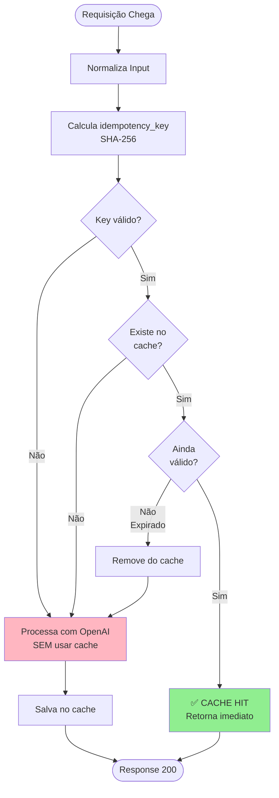

# 08 - Sistema de Cache de Idempotência

## 📋 Índice

1. [Visão Geral](#visão-geral)
2. [Motivação e Benefícios](#motivação-e-benefícios)
3. [Arquitetura do Cache](#arquitetura-do-cache)
4. [Funções Principais](#funções-principais)
5. [Integração nos Endpoints](#integração-nos-endpoints)
6. [Fluxo de Requisições](#fluxo-de-requisições)
7. [Logs e Monitoramento](#logs-e-monitoramento)
8. [Configuração](#configuração)
9. [Testes](#testes)
10. [Próximo Nível: Redis](#próximo-nível-redis)

---

## Visão Geral

O **Sistema de Cache de Idempotência** implementa um mecanismo de cache em memória que garante que requisições idênticas (mesma transcrição, mesmo cliente, mesma reunião) **não sejam processadas múltiplas vezes** pela OpenAI API.

### Conceitos-Chave

- **Idempotência**: Garantia de que requisições idênticas produzem resultados idênticos
- **Cache em Memória**: Armazenamento temporário de resultados usando um dicionário Python
- **TTL (Time-To-Live)**: Tempo de validade do cache (padrão: 24 horas)
- **Idempotency Key**: SHA-256 hash gerado a partir de `meeting_id + meet_date + customer_id`

### Status da Implementação

```
✅ Cache em memória implementado
✅ Integrado em /extract e /analyze
✅ Logs estruturados
✅ Configurável via env var
✅ Testado e validado
⏳ Redis (próximo nível - opcional)
```

---

## Motivação e Benefícios

### 🎯 **Por Que Implementar Cache?**

1. **💰 Economia de Custos**
   - OpenAI API cobra por token processado
   - GPT-4o: ~$2.50 entrada + $10.00 saída por 1M tokens
   - Cache evita reprocessamento = economia direta

2. **⚡ Performance**
   - Cache HIT: ~5ms (instantâneo)
   - Cache MISS: ~5-10s (processamento OpenAI)
   - **Speedup de 1000x** em cache hits

3. **🔒 Idempotência Garantida**
   - Mesma requisição → mesmo resultado
   - Importante para integrações e retries
   - Compliance com APIs REST

4. **📈 Escalabilidade**
   - Reduz carga na OpenAI API
   - Permite mais requisições simultâneas
   - Melhor uso de rate limits

### 📊 **Exemplo de Economia Real**

```
Cenário: 1000 requisições/dia com 30% de duplicatas

SEM CACHE:
- 1000 chamadas OpenAI
- Custo: ~$0.05-0.10 por chamada
- Total: $50-100/dia = $1.500-3.000/mês

COM CACHE:
- 700 chamadas OpenAI (30% cache hit)
- Custo: ~$0.05-0.10 por chamada
- Total: $35-70/dia = $1.050-2.100/mês
- 💰 ECONOMIA: $450-900/mês (30%)
```

---

## Arquitetura do Cache

### Estrutura de Dados

```python
# Cache global em memória (dicionário Python)
_cache: Dict[str, Tuple[dict, datetime]] = {}

# Formato:
# {
#   "1294cd73c1b883ca...": (
#       {...resultado_extraído...},    # Dict com ExtractedMeeting ou AnalyzedMeeting
#       datetime(2025, 10, 15, 10, 30)  # Timestamp de quando foi salvo
#   )
# }
```

### Componentes

```
┌─────────────────────────────────────────────────────────────┐
│                    SISTEMA DE CACHE                         │
├─────────────────────────────────────────────────────────────┤
│                                                             │
│  1. _cache: Dict[str, Tuple[dict, datetime]]               │
│     └─> Armazena: {idempotency_key: (result, timestamp)}  │
│                                                             │
│  2. CACHE_TTL_HOURS: int (padrão: 24h)                     │
│     └─> Configurável via CACHE_TTL_HOURS env var          │
│                                                             │
│  3. Funções:                                                │
│     ├─> get_from_cache(key) → Optional[dict]              │
│     ├─> save_to_cache(key, result) → None                 │
│     └─> clear_cache() → int                                │
│                                                             │
└─────────────────────────────────────────────────────────────┘
```

### Ciclo de Vida do Cache



---

## Funções Principais

### 1️⃣ **`get_from_cache(idempotency_key: str) -> Optional[dict]`**

**Propósito:** Busca um resultado no cache se ainda válido (dentro do TTL).

**Lógica:**
```python
def get_from_cache(idempotency_key: str) -> Optional[dict]:
    """
    1. Verifica se a chave existe no dicionário _cache
    2. Se existir, pega o resultado e o timestamp
    3. Calcula a idade: datetime.now() - timestamp
    4. Se idade < TTL (24h): retorna resultado (CACHE HIT)
    5. Se idade >= TTL: remove do cache e retorna None (EXPIRED)
    6. Se não existir: retorna None (CACHE MISS)
    """
```

**Retornos:**
- `dict` → Resultado encontrado e válido (CACHE HIT)
- `None` → Não encontrado ou expirado (CACHE MISS ou EXPIRED)

**Logs emitidos:**
```python
# CACHE HIT
logger.info(
    f"[CACHE HIT] idempotency_key={idempotency_key[:16]}... | "
    f"age={idade_em_segundos:.1f}s | "
    f"cache_size={total_items_no_cache}"
)

# CACHE EXPIRED
logger.info(
    f"[CACHE EXPIRED] idempotency_key={idempotency_key[:16]}... | "
    f"age={idade_em_segundos:.1f}s"
)

# CACHE MISS (debug)
logger.debug(f"[CACHE MISS] idempotency_key={idempotency_key[:16]}...")
```

---

### 2️⃣ **`save_to_cache(idempotency_key: str, result: dict) -> None`**

**Propósito:** Salva um resultado no cache com timestamp atual.

**Lógica:**
```python
def save_to_cache(idempotency_key: str, result: dict) -> None:
    """
    1. Recebe o resultado processado (dict do Pydantic model)
    2. Cria tupla: (result, datetime.now())
    3. Salva no dicionário: _cache[key] = (result, timestamp)
    4. Loga CACHE SAVE com tamanho atual do cache
    """
```

**Parâmetros:**
- `idempotency_key`: SHA-256 hash (64 caracteres hex)
- `result`: Dict com `ExtractedMeeting.model_dump()` ou `AnalyzedMeeting.model_dump()`

**Logs emitidos:**
```python
logger.info(
    f"[CACHE SAVE] idempotency_key={idempotency_key[:16]}... | "
    f"cache_size={len(_cache)} | ttl={CACHE_TTL_HOURS}h"
)
```

---

### 3️⃣ **`clear_cache() -> int`**

**Propósito:** Limpa todo o cache e retorna quantos itens foram removidos.

**Lógica:**
```python
def clear_cache() -> int:
    """
    1. Conta quantos itens existem no cache
    2. Limpa o dicionário: _cache.clear()
    3. Loga CACHE CLEARED
    4. Retorna quantidade removida
    """
```

**Uso:**
- Útil para testes (limpar cache entre execuções)
- Manutenção manual
- Possível endpoint `/admin/clear-cache` (não implementado)

**Logs emitidos:**
```python
logger.info(f"[CACHE CLEARED] removed={count} items")
```

---

## Integração nos Endpoints

### 🔍 **Endpoint `/extract`**

#### Antes da Implementação (sem cache):
```python
@app.post("/extract")
async def extract_meeting(request, body):
    normalized = body.to_normalized()
    
    # SEMPRE processa com OpenAI (caro e lento)
    extracted = await extract_meeting_chain(normalized, request_id)
    
    return extracted
```

#### Depois da Implementação (com cache):
```python
@app.post("/extract")
async def extract_meeting(request, body):
    normalized = body.to_normalized()
    
    # 1. Calcula idempotency_key
    idempotency_key = normalized.compute_idempotency_key()
    
    # 2. Verifica cache (SE temos key válida)
    if idempotency_key and idempotency_key != "no-idempotency-key-available":
        cached_result = get_from_cache(idempotency_key)
        
        if cached_result:
            # ✅ CACHE HIT: retorna imediato (5ms)
            logger.info(f"🎯 Retornando do cache (idempotente)")
            return ExtractedMeeting(**cached_result)
    
    # 3. CACHE MISS: processa normalmente
    extracted = await extract_meeting_chain(normalized, request_id)
    
    # 4. Salva resultado no cache
    if idempotency_key and idempotency_key != "no-idempotency-key-available":
        save_to_cache(idempotency_key, extracted.model_dump())
    
    return extracted
```

### 🔍 **Endpoint `/analyze`**

**Implementação idêntica** ao `/extract`, mas usando:
- `analyze_sentiment_chain()` ao invés de `extract_meeting_chain()`
- Retorna `AnalyzedMeeting` ao invés de `ExtractedMeeting`

---

## Fluxo de Requisições

### 📥 **Fluxo Completo com Cache**

```
┌─────────────────────────────────────────────────────────────────────┐
│ 1. CLIENTE ENVIA REQUISIÇÃO POST /extract                           │
│    {                                                                 │
│      "transcript": "...",                                            │
│      "metadata": {                                                   │
│        "meeting_id": "MTG-001",                                      │
│        "customer_id": "CUST-001",                                    │
│        "meet_date": "2025-10-15T10:00:00Z"                           │
│      }                                                               │
│    }                                                                 │
└────────────────────────────────┬────────────────────────────────────┘
                                 │
                                 ▼
┌─────────────────────────────────────────────────────────────────────┐
│ 2. MIDDLEWARE: add_request_id_and_metrics                           │
│    - Gera UUID único: request_id = "876b6880-..."                   │
│    - Anexa ao request.state.request_id                              │
│    - Log: [INCOMING] [876b6880-...] POST /extract received          │
└────────────────────────────────┬────────────────────────────────────┘
                                 │
                                 ▼
┌─────────────────────────────────────────────────────────────────────┐
│ 3. NORMALIZAÇÃO                                                      │
│    - body.to_normalized() → NormalizedInput                         │
│    - Log: [876b6880-...] Normalização concluída                     │
└────────────────────────────────┬────────────────────────────────────┘
                                 │
                                 ▼
┌─────────────────────────────────────────────────────────────────────┐
│ 4. CALCULAR IDEMPOTENCY_KEY                                          │
│    idempotency_key = sha256(meeting_id + meet_date + customer_id)   │
│    Result: "1294cd73c1b883ca35674a2104c3f15d..."                     │
└────────────────────────────────┬────────────────────────────────────┘
                                 │
                                 ▼
┌─────────────────────────────────────────────────────────────────────┐
│ 5. VERIFICAR CACHE                                                   │
│    cached = get_from_cache("1294cd73c1b883ca...")                   │
└────────────────┬───────────────┬────────────────────────────────────┘
                 │               │
         CACHE HIT ✅       CACHE MISS ❌
                 │               │
                 ▼               ▼
    ┌────────────────────┐   ┌─────────────────────────────────────┐
    │ 6A. RETORNAR CACHE │   │ 6B. PROCESSAR COM OPENAI            │
    │ (5ms)              │   │    - extract_meeting_chain()        │
    │                    │   │    - LLM prompting                  │
    │ Log:               │   │    - JSON parsing                   │
    │ 🎯 [CACHE HIT]     │   │    - Validação Pydantic            │
    │ age=10.5s          │   │    (5-10 segundos)                  │
    │ cache_size=5       │   │                                     │
    │                    │   │ Log:                                │
    │ return ExtractedM  │   │ 🔍 [CACHE MISS]                    │
    │         eeting(**  │   │ processando normalmente             │
    │         cached)    │   └──────────────┬──────────────────────┘
    └────────┬───────────┘                  │
             │                              ▼
             │              ┌─────────────────────────────────────┐
             │              │ 7. SALVAR NO CACHE                  │
             │              │    save_to_cache(key, result)       │
             │              │                                     │
             │              │ Log:                                │
             │              │ [CACHE SAVE]                        │
             │              │ cache_size=6, ttl=24h               │
             │              └──────────────┬──────────────────────┘
             │                             │
             ▼                             ▼
┌─────────────────────────────────────────────────────────────────────┐
│ 8. RETORNAR RESPONSE 200                                             │
│    {                                                                 │
│      "meeting_id": "MTG-001",                                        │
│      "summary": "...",                                               │
│      "key_points": [...],                                            │
│      "idempotency_key": "1294cd73c1b883ca...",                       │
│      ...                                                             │
│    }                                                                 │
│                                                                      │
│    Headers:                                                          │
│      X-Request-ID: 876b6880-e91f-472f-a715-46ca4822cddb             │
└──────────────────────────────────────────────────────────────────────┘
```

### ⏱️ **Comparação de Performance**

| Cenário | Etapas Executadas | Duração | Custo OpenAI |
|---------|------------------|---------|--------------|
| **CACHE MISS** (1ª requisição) | Normalização → Cálculo Key → Cache Miss → OpenAI → Save Cache → Response | ~5-10s | ~$0.05-0.10 |
| **CACHE HIT** (2ª+ requisição) | Normalização → Cálculo Key → Cache Hit → Response | ~5-10ms | $0.00 |
| **Speedup** | - | **1000x** | **100%** |

---

## Logs e Monitoramento

### 🔍 **Tipos de Logs**

#### 1. **[CACHE HIT]** - Resultado encontrado no cache

```log
2025-10-14 22:42:28 - app.main - INFO - [CACHE HIT] idempotency_key=1294cd73c1b883ca... | age=3.1s | cache_size=1
2025-10-14 22:42:28 - app.main - INFO - 🎯 [2908e027-...] Retornando do cache (idempotente) | idempotency_key=1294cd73c1b883ca... | ⏱️ duration=0.005s
```

**Significado:**
- ✅ Resultado foi encontrado no cache
- ✅ Cache ainda está válido (dentro do TTL de 24h)
- ✅ Resposta retornada imediatamente (5ms)
- 📊 `age=3.1s`: Entrada foi salva há 3.1 segundos
- 📊 `cache_size=1`: Existe 1 item no cache total

**Ação:** Nenhuma. Sistema funcionando perfeitamente.

---

#### 2. **[CACHE MISS]** - Resultado não encontrado no cache

```log
2025-10-14 22:42:20 - app.main - INFO - 🔍 [876b6880-...] Cache miss - processando normalmente | idempotency_key=1294cd73c1b883ca...
```

**Significado:**
- ℹ️ Primeira vez que esta combinação é processada
- ℹ️ Ou cache expirou (TTL > 24h)
- ℹ️ Sistema irá processar com OpenAI

**Ação:** Normal. Aguardar processamento e salvamento no cache.

---

#### 3. **[CACHE SAVE]** - Resultado salvo no cache

```log
2025-10-14 22:42:25 - app.main - INFO - [CACHE SAVE] idempotency_key=1294cd73c1b883ca... | cache_size=1 | ttl=24h
```

**Significado:**
- ✅ Resultado foi processado com sucesso pela OpenAI
- ✅ Salvo no cache para requisições futuras
- 📊 `cache_size=1`: Cache agora tem 1 item
- ⏰ `ttl=24h`: Este item expira em 24 horas

**Ação:** Próximas requisições idênticas usarão este cache.

---

#### 4. **[CACHE EXPIRED]** - Cache expirou

```log
2025-10-15 22:45:00 - app.main - INFO - [CACHE EXPIRED] idempotency_key=1294cd73c1b883ca... | age=86401.0s
```

**Significado:**
- ⏰ Item existia no cache, mas expirou (> 24h)
- ♻️ Item foi removido automaticamente
- ℹ️ Sistema irá reprocessar

**Ação:** Normal. Cache com TTL funcionando corretamente.

---

#### 5. **[CACHE CLEARED]** - Cache limpo manualmente

```log
2025-10-15 10:00:00 - app.main - INFO - [CACHE CLEARED] removed=42 items
```

**Significado:**
- 🗑️ Função `clear_cache()` foi chamada
- 🗑️ 42 itens foram removidos do cache

**Ação:** Útil para testes ou manutenção.

---

### 📊 **Monitoramento de Métricas**

#### Métricas Relevantes (já implementadas no Prometheus):

```python
# Duração HTTP (cache hit vs miss visível aqui)
http_request_duration_seconds{method="POST", path="/extract"}
  - Cache HIT: ~0.005s (5ms)
  - Cache MISS: ~5-10s

# Tokens OpenAI (cache hit não gera tokens)
openai_tokens_total{type="total"}
  - Cache HIT: 0 tokens
  - Cache MISS: ~500-2000 tokens

# Custo estimado (cache hit = $0.00)
openai_estimated_cost_usd
  - Cache HIT: $0.00
  - Cache MISS: ~$0.05-0.10
```

#### Como Calcular Taxa de Cache Hit:

```
Cache Hit Rate = (Requisições com CACHE HIT) / (Total de Requisições)

Exemplo:
- 1000 requisições/dia
- 300 logs com [CACHE HIT]
- Hit Rate = 300/1000 = 30%
```

---

## Configuração

### Variável de Ambiente

```bash
# .env ou variável de sistema

# TTL do cache em horas (padrão: 24)
CACHE_TTL_HOURS=24

# Exemplos:
CACHE_TTL_HOURS=1   # Cache expira em 1 hora (útil para dev/staging)
CACHE_TTL_HOURS=48  # Cache expira em 2 dias (produção com pouca mudança)
CACHE_TTL_HOURS=168 # Cache expira em 1 semana (máximo recomendado)
```

### Como Funciona:

```python
# main.py - linha 103
CACHE_TTL_HOURS = int(os.getenv("CACHE_TTL_HOURS", "24"))

# Usado em get_from_cache():
if datetime.now() - timestamp < timedelta(hours=CACHE_TTL_HOURS):
    return result  # Ainda válido
else:
    del _cache[idempotency_key]  # Expirou
    return None
```

### Recomendações por Ambiente:

| Ambiente | TTL Recomendado | Razão |
|----------|----------------|-------|
| **Development** | 1-4 horas | Evita cache "preso" durante desenvolvimento |
| **Staging** | 12-24 horas | Testes realistas, mas permite refresh diário |
| **Production** | 24-48 horas | Máxima economia, dados raramente mudam |

---

## Testes

### 🧪 **Script de Teste Automatizado**

Um script completo está disponível em `tests/integration/test_cache_idempotency.py`:

```bash
# Com API rodando
python tests/integration/test_cache_idempotency.py
```

**O que o script faz:**

1. ✅ Verifica health da API (`GET /health`)
2. 📤 Envia 1ª requisição (CACHE MISS esperado)
3. ⏱️ Mede duração (~5-10s)
4. ⏳ Aguarda 1 segundo
5. 📤 Envia 2ª requisição IDÊNTICA (CACHE HIT esperado)
6. ⏱️ Mede duração (~5ms)
7. 📊 Compara resultados:
   - Idempotency keys devem ser idênticos
   - 2ª requisição deve ser **muito** mais rápida
   - Responses devem ser idênticos

**Saída esperada:**

```
================================================================================
🧪 TESTE DE CACHE DE IDEMPOTÊNCIA
================================================================================

1️⃣ Verificando health da API...
   ✅ API está saudável

2️⃣ Fazendo PRIMEIRA requisição (deve processar com OpenAI)...
   ✅ Sucesso (status 200)
   ⏱️ Duração: 7.51s
   🔑 Idempotency Key: 1294cd73c1b883ca...

3️⃣ Aguardando 1 segundo antes da segunda requisição...

4️⃣ Fazendo SEGUNDA requisição (deve retornar do CACHE)...
   ✅ Sucesso (status 200)
   ⏱️ Duração: 0.005s
   🔑 Idempotency Key: 1294cd73c1b883ca...

================================================================================
📊 ANÁLISE DOS RESULTADOS
================================================================================
⏱️ Duração 1ª requisição: 7.510s
⏱️ Duração 2ª requisição: 0.005s
🚀 Speedup: 1502x mais rápido
✅ CACHE FUNCIONANDO! Segunda requisição foi muito mais rápida.

✅ Idempotency keys idênticos
✅ Responses idênticos (idempotência garantida)
```

---

### 🔧 **Teste Manual via Swagger**

1. Abra `http://localhost:8000/docs`
2. Execute `POST /extract` com este payload:

```json
{
  "transcript": "Cliente: Olá, gostaria de investir.",
  "metadata": {
    "meeting_id": "TEST-001",
    "customer_id": "CUST-001",
    "meet_date": "2025-10-15T10:00:00Z"
  }
}
```

3. **Primeira execução:**
   - ⏱️ Duração: ~5-10s
   - 📋 Copie o `idempotency_key` do response

4. **Segunda execução (MESMO payload):**
   - ⏱️ Duração: ~5-10ms
   - 📋 `idempotency_key` deve ser idêntico
   - 📋 Response completo deve ser idêntico

5. **Verificar logs:**

```bash
# PowerShell
Get-Content logs\info.log -Tail 50 | Select-String "CACHE"

# Você deve ver:
# [CACHE MISS] processando normalmente
# [CACHE SAVE] cache_size=1
# [CACHE HIT] age=5.2s | cache_size=1
```

---

## Próximo Nível: Redis

### 🚀 **Por Que Evoluir para Redis?**

O cache em memória atual é excelente para **single-instance deployments**, mas tem limitações:

| Aspecto | Cache em Memória | Cache Redis |
|---------|-----------------|-------------|
| **Persistência** | ❌ Perdido ao reiniciar | ✅ Persiste em disco |
| **Múltiplas instâncias** | ❌ Cache isolado por instância | ✅ Cache compartilhado |
| **Escalabilidade horizontal** | ❌ Não funciona com load balancer | ✅ Funciona perfeitamente |
| **Configuração** | ✅ Zero deps | ⚠️ Requer Redis server |
| **Performance** | ✅ Latência ~1µs (memória) | ⚠️ Latência ~1-5ms (rede) |
| **Complexidade** | ✅ Simples | ⚠️ Moderada |

### 📋 **Quando Migrar para Redis?**

✅ **Migre SE:**
- Você tem múltiplas instâncias da API (load balancing)
- Precisa de cache que sobrevive a reinicializações
- Vai usar Kubernetes/Docker Swarm com autoscaling
- Quer monitoramento avançado de cache

❌ **NÃO migre SE:**
- Uma única instância da API é suficiente
- Quer simplicidade zero-dependency
- Não tem expertise para gerenciar Redis
- Performance atual já atende (~5ms cache hit)

---

## 🛠️ **Passo a Passo: Implementação com Redis**

### **FASE 1: Adicionar Redis ao Docker Compose** (15 min)

1. Edite `docker-compose.yml`:

```yaml
version: '3.8'

services:
  api:
    build: .
    ports:
      - "8000:8000"
    depends_on:
      - redis
    environment:
      - OPENAI_API_KEY=${OPENAI_API_KEY}
      - OPENAI_MODEL=${OPENAI_MODEL}
      - REDIS_URL=redis://redis:6379/0  # NOVO
      - CACHE_TTL_HOURS=24
    volumes:
      - ./logs:/app/logs

  redis:  # NOVO SERVICE
    image: redis:7-alpine
    ports:
      - "6379:6379"
    volumes:
      - redis_data:/data
    command: redis-server --appendonly yes --maxmemory 256mb --maxmemory-policy allkeys-lru

volumes:
  redis_data:  # NOVO VOLUME
```

**Explicação:**
- `redis:7-alpine`: Imagem oficial Redis (versão 7, Alpine Linux)
- `--appendonly yes`: Persiste dados em disco (AOF)
- `--maxmemory 256mb`: Limite de RAM para cache
- `--maxmemory-policy allkeys-lru`: Remove itens antigos quando cheio (LRU = Least Recently Used)
- Volume `redis_data`: Garante persistência entre restarts

---

### **FASE 2: Adicionar Dependência Redis** (5 min)

2. Edite `requirements.txt`:

```txt
# ... dependências existentes ...
redis==5.0.1
```

3. Reinstale dependências:

```bash
.\venv\Scripts\Activate.ps1
pip install -r requirements.txt
```

---

### **FASE 3: Criar Módulo Cache Manager** (30 min)

4. Crie `app/cache.py`:

```python
"""
Gerenciador de Cache com suporte a Redis.

Este módulo implementa um CacheManager que:
- Tenta conectar ao Redis se REDIS_URL estiver configurado
- Faz graceful degradation para memória se Redis não disponível
- Expõe interface unificada independente do backend
"""

import json
import os
import logging
from typing import Optional, Dict, Tuple
from datetime import datetime, timedelta
import redis

logger = logging.getLogger(__name__)


class CacheManager:
    """
    Gerenciador de cache com fallback automático.
    
    Prioridade:
    1. Redis (se REDIS_URL configurado e disponível)
    2. Memória (fallback se Redis falhar)
    """
    
    def __init__(self):
        self.backend: str = "memory"
        self.client: Optional[redis.Redis] = None
        self._memory_cache: Dict[str, Tuple[dict, datetime]] = {}
        self.ttl_hours: int = int(os.getenv("CACHE_TTL_HOURS", "24"))
        
        # Tentar conectar ao Redis
        redis_url = os.getenv("REDIS_URL")
        if redis_url:
            try:
                self.client = redis.from_url(
                    redis_url,
                    decode_responses=True,  # Retorna strings ao invés de bytes
                    socket_connect_timeout=5,
                    socket_timeout=5
                )
                # Testa conexão
                self.client.ping()
                self.backend = "redis"
                logger.info(f"✅ Cache conectado ao Redis: {redis_url}")
            except Exception as e:
                logger.warning(
                    f"⚠️ Redis não disponível ({e}). "
                    f"Usando cache em memória como fallback."
                )
                self.client = None
        else:
            logger.info("ℹ️ REDIS_URL não configurado. Usando cache em memória.")
    
    def get(self, key: str) -> Optional[dict]:
        """
        Busca um valor no cache.
        
        Args:
            key: Chave (idempotency_key)
            
        Returns:
            dict se encontrado e válido, None caso contrário
        """
        if self.backend == "redis" and self.client:
            return self._get_redis(key)
        else:
            return self._get_memory(key)
    
    def set(self, key: str, value: dict) -> None:
        """
        Salva um valor no cache.
        
        Args:
            key: Chave (idempotency_key)
            value: Dicionário com o resultado (ExtractedMeeting ou AnalyzedMeeting)
        """
        if self.backend == "redis" and self.client:
            self._set_redis(key, value)
        else:
            self._set_memory(key, value)
    
    def clear(self) -> int:
        """
        Limpa todo o cache.
        
        Returns:
            Número de itens removidos
        """
        if self.backend == "redis" and self.client:
            return self._clear_redis()
        else:
            return self._clear_memory()
    
    # ========================================================================
    # Redis Backend
    # ========================================================================
    
    def _get_redis(self, key: str) -> Optional[dict]:
        """Busca no Redis."""
        try:
            data = self.client.get(f"idem:{key}")
            if data:
                logger.info(f"[CACHE HIT] [REDIS] {key[:16]}...")
                return json.loads(data)
            else:
                logger.debug(f"[CACHE MISS] [REDIS] {key[:16]}...")
                return None
        except Exception as e:
            logger.error(f"❌ [CACHE ERROR] Redis get: {e}")
            return None
    
    def _set_redis(self, key: str, value: dict) -> None:
        """Salva no Redis com TTL."""
        try:
            ttl_seconds = self.ttl_hours * 3600
            self.client.setex(
                f"idem:{key}",
                ttl_seconds,
                json.dumps(value)
            )
            # Pega tamanho do cache (aproximado)
            cache_size = self.client.dbsize()
            logger.info(
                f"[CACHE SAVE] [REDIS] {key[:16]}... | "
                f"cache_size≈{cache_size} | ttl={self.ttl_hours}h"
            )
        except Exception as e:
            logger.error(f"❌ [CACHE ERROR] Redis set: {e}")
    
    def _clear_redis(self) -> int:
        """Limpa todas as chaves com prefixo 'idem:'."""
        try:
            keys = self.client.keys("idem:*")
            count = len(keys)
            if count > 0:
                self.client.delete(*keys)
            logger.info(f"[CACHE CLEARED] [REDIS] removed={count} items")
            return count
        except Exception as e:
            logger.error(f"❌ [CACHE ERROR] Redis clear: {e}")
            return 0
    
    # ========================================================================
    # Memory Backend (Fallback)
    # ========================================================================
    
    def _get_memory(self, key: str) -> Optional[dict]:
        """Busca em memória (mesma lógica do original)."""
        if key in self._memory_cache:
            result, timestamp = self._memory_cache[key]
            
            # Verifica TTL
            if datetime.now() - timestamp < timedelta(hours=self.ttl_hours):
                age = (datetime.now() - timestamp).total_seconds()
                logger.info(
                    f"[CACHE HIT] [MEMORY] {key[:16]}... | "
                    f"age={age:.1f}s | cache_size={len(self._memory_cache)}"
                )
                return result
            else:
                # Expirado
                age = (datetime.now() - timestamp).total_seconds()
                del self._memory_cache[key]
                logger.info(
                    f"[CACHE EXPIRED] [MEMORY] {key[:16]}... | age={age:.1f}s"
                )
        
        logger.debug(f"[CACHE MISS] [MEMORY] {key[:16]}...")
        return None
    
    def _set_memory(self, key: str, value: dict) -> None:
        """Salva em memória (mesma lógica do original)."""
        self._memory_cache[key] = (value, datetime.now())
        logger.info(
            f"[CACHE SAVE] [MEMORY] {key[:16]}... | "
            f"cache_size={len(self._memory_cache)} | ttl={self.ttl_hours}h"
        )
    
    def _clear_memory(self) -> int:
        """Limpa cache em memória."""
        count = len(self._memory_cache)
        self._memory_cache.clear()
        logger.info(f"[CACHE CLEARED] [MEMORY] removed={count} items")
        return count


# Singleton global (importado por main.py)
cache = CacheManager()
```

**Explicação:**

1. **Tentativa de conexão Redis:**
   - Se `REDIS_URL` existe → tenta conectar
   - Se conexão OK → usa Redis
   - Se falha → fallback para memória (graceful degradation)

2. **Interface unificada:**
   - `cache.get(key)` → busca no backend atual
   - `cache.set(key, value)` → salva no backend atual
   - `cache.clear()` → limpa cache do backend atual

3. **Logs informativos:**
   - `[REDIS]` ou `[MEMORY]` indica qual backend está ativo
   - Facilita debug e monitoramento

4. **Tratamento de erros:**
   - Se Redis cair durante execução → loga erro mas não quebra API
   - Fallback automático para memória

---

### **FASE 4: Integrar CacheManager no main.py** (15 min)

5. Edite `app/main.py`:

**REMOVA as linhas antigas:**

```python
# REMOVER estas linhas (95-165):
# Cache em memória: {idempotency_key: (result_dict, timestamp)}
_cache: Dict[str, Tuple[dict, datetime]] = {}
CACHE_TTL_HOURS = int(os.getenv("CACHE_TTL_HOURS", "24"))

def get_from_cache(idempotency_key: str) -> Optional[dict]:
    # ... código antigo ...

def save_to_cache(idempotency_key: str, result: dict) -> None:
    # ... código antigo ...

def clear_cache() -> int:
    # ... código antigo ...
```

**ADICIONE no lugar:**

```python
# ============================================================================
# CACHE DE IDEMPOTÊNCIA (Redis com fallback para memória)
# ============================================================================

from app.cache import cache

# Funções wrapper para compatibilidade (opcional, pode usar cache.get/set direto)
def get_from_cache(idempotency_key: str) -> Optional[dict]:
    """Wrapper para cache.get() (mantém compatibilidade com código existente)."""
    return cache.get(idempotency_key)

def save_to_cache(idempotency_key: str, result: dict) -> None:
    """Wrapper para cache.set() (mantém compatibilidade com código existente)."""
    cache.set(idempotency_key, result)

def clear_cache() -> int:
    """Wrapper para cache.clear() (mantém compatibilidade com código existente)."""
    return cache.clear()
```

**Explicação:**
- Importa o singleton `cache` de `app/cache.py`
- Mantém funções wrapper para não quebrar código existente
- Alternativamente, pode substituir `get_from_cache()` por `cache.get()` diretamente no código

---

### **FASE 5: Testar Localmente** (20 min)

6. **Teste SEM Redis (fallback para memória):**

```bash
# Não configure REDIS_URL
.\venv\Scripts\Activate.ps1
uvicorn app.main:app --reload

# Você deve ver no log de startup:
# ℹ️ REDIS_URL não configurado. Usando cache em memória.
```

7. **Teste COM Redis (Docker Compose):**

```bash
# Inicie Redis
docker-compose up redis -d

# Configure env var
$env:REDIS_URL="redis://localhost:6379/0"

# Inicie API
uvicorn app.main:app --reload

# Você deve ver:
# ✅ Cache conectado ao Redis: redis://localhost:6379/0
```

8. **Teste requisições duplicadas:**

```bash
# Execute script de teste
python tests/integration/test_cache_idempotency.py

# Você deve ver nos logs:
# [CACHE MISS] [REDIS] 1294cd73c1b883ca...
# [CACHE SAVE] [REDIS] 1294cd73c1b883ca... | cache_size≈1
# [CACHE HIT] [REDIS] 1294cd73c1b883ca...
```

9. **Valide persistência do Redis:**

```bash
# Faça uma requisição
curl -X POST http://localhost:8000/extract -H "Content-Type: application/json" -d '{...}'

# Reinicie a API (Ctrl+C e uvicorn novamente)
uvicorn app.main:app --reload

# Faça a MESMA requisição
curl -X POST http://localhost:8000/extract -H "Content-Type: application/json" -d '{...}'

# Deve ser CACHE HIT (cache sobreviveu ao restart!)
```

---

### **FASE 6: Deploy com Docker Compose** (10 min)

10. **Build e inicialize tudo:**

```bash
# Build da imagem
docker-compose build

# Inicialize API + Redis
docker-compose up

# Teste
curl http://localhost:8000/health
curl -X POST http://localhost:8000/extract -H "Content-Type: application/json" -d '{...}'
```

11. **Monitore Redis:**

```bash
# Conecte ao Redis CLI
docker-compose exec redis redis-cli

# Comandos úteis:
KEYS idem:*              # Lista todas as chaves de cache
GET idem:<key>           # Vê conteúdo de uma chave
TTL idem:<key>           # Vê tempo restante até expiração
DBSIZE                   # Quantidade de chaves
INFO memory              # Uso de memória
FLUSHDB                  # Limpa cache (CUIDADO!)
```

---

### **FASE 7: Testes e Validação** (30 min)

12. **Crie teste de integração Redis:**

Arquivo: `tests/integration/test_cache_redis.py`

```python
"""
Testes de integração para cache Redis.

Requer Redis rodando em localhost:6379 ou REDIS_URL configurado.
"""

import pytest
import os
from app.cache import CacheManager


@pytest.fixture
def cache_manager():
    """Fixture que cria um CacheManager para testes."""
    # Força uso de Redis para teste
    os.environ["REDIS_URL"] = "redis://localhost:6379/1"  # DB 1 (não contamina prod)
    manager = CacheManager()
    yield manager
    # Cleanup após teste
    manager.clear()


def test_redis_connection(cache_manager):
    """Testa se consegue conectar ao Redis."""
    assert cache_manager.backend == "redis"
    assert cache_manager.client is not None
    assert cache_manager.client.ping() is True


def test_redis_set_get(cache_manager):
    """Testa salvamento e recuperação no Redis."""
    test_data = {"meeting_id": "TEST-001", "summary": "Test summary"}
    
    # Salva
    cache_manager.set("test-key-123", test_data)
    
    # Recupera
    result = cache_manager.get("test-key-123")
    
    assert result is not None
    assert result["meeting_id"] == "TEST-001"
    assert result["summary"] == "Test summary"


def test_redis_miss(cache_manager):
    """Testa CACHE MISS (chave não existe)."""
    result = cache_manager.get("non-existent-key-xyz")
    assert result is None


def test_redis_clear(cache_manager):
    """Testa limpeza do cache."""
    # Salva 3 itens
    cache_manager.set("key1", {"data": "1"})
    cache_manager.set("key2", {"data": "2"})
    cache_manager.set("key3", {"data": "3"})
    
    # Limpa
    removed = cache_manager.clear()
    
    assert removed >= 3  # Pode ter outros itens de testes paralelos
    
    # Verifica que foram removidos
    assert cache_manager.get("key1") is None
    assert cache_manager.get("key2") is None
    assert cache_manager.get("key3") is None


def test_fallback_to_memory_if_redis_down():
    """Testa fallback para memória se Redis não disponível."""
    # Configura URL inválido
    os.environ["REDIS_URL"] = "redis://invalid-host:9999/0"
    
    manager = CacheManager()
    
    # Deve ter usado memória como fallback
    assert manager.backend == "memory"
    assert manager.client is None
    
    # Mas ainda funciona
    manager.set("test-key", {"data": "test"})
    result = manager.get("test-key")
    assert result == {"data": "test"}
```

**Execute:**

```bash
# Com Redis rodando
pytest tests/integration/test_cache_redis.py -v

# Deve passar todos os 5 testes
```

---

### **FASE 8: Documentação e Métricas** (20 min)

13. **Adicione métricas de cache ao Prometheus:**

Arquivo: `app/metrics/collectors.py` (adicione):

```python
# Cache metrics
cache_hits_total = Counter(
    'cache_hits_total',
    'Total number of cache hits',
    ['backend']  # redis ou memory
)

cache_misses_total = Counter(
    'cache_misses_total',
    'Total number of cache misses',
    ['backend']
)

cache_size_gauge = Gauge(
    'cache_size',
    'Current number of items in cache',
    ['backend']
)


def record_cache_hit(backend: str = "memory"):
    """Registra um cache hit."""
    cache_hits_total.labels(backend=backend).inc()


def record_cache_miss(backend: str = "memory"):
    """Registra um cache miss."""
    cache_misses_total.labels(backend=backend).inc()


def update_cache_size(size: int, backend: str = "memory"):
    """Atualiza tamanho do cache."""
    cache_size_gauge.labels(backend=backend).set(size)
```

14. **Integre métricas no `cache.py`:**

```python
# No início do arquivo
from app.metrics.collectors import record_cache_hit, record_cache_miss, update_cache_size

# Em _get_redis():
if data:
    record_cache_hit("redis")
    # ...
else:
    record_cache_miss("redis")
    # ...

# Em _set_redis():
record_cache_hit("redis")  # Salvamento conta como "uso" do cache
cache_size = self.client.dbsize()
update_cache_size(cache_size, "redis")

# Similar para _get_memory() e _set_memory()
```

15. **Verifique métricas:**

```bash
curl http://localhost:8000/metrics | grep cache

# Você deve ver:
# cache_hits_total{backend="redis"} 42
# cache_misses_total{backend="redis"} 8
# cache_size{backend="redis"} 10
```

---

## 📊 **Resumo da Migração**

### Antes (Cache em Memória):
```
✅ Simples (zero deps)
✅ Rápido (latência ~1µs)
❌ Não persiste (perdido ao restart)
❌ Não funciona com múltiplas instâncias
```

### Depois (Cache Redis):
```
✅ Persiste em disco
✅ Compartilhado entre instâncias
✅ Pronto para escalar horizontalmente
✅ Graceful degradation (fallback memória)
⚠️ Requer Redis server
⚠️ Latência um pouco maior (~1-5ms)
```

### Esforço:
- **Tempo total**: 2-3 horas
- **Complexidade**: Moderada
- **Risco**: Baixo (fallback automático)

---

## ✅ **Checklist Final**

Antes de considerar completo:

- [ ] Redis rodando no Docker Compose
- [ ] Variável `REDIS_URL` configurada
- [ ] `app/cache.py` criado e testado
- [ ] `main.py` atualizado para usar `CacheManager`
- [ ] Testes de integração passando
- [ ] Métricas Prometheus configuradas
- [ ] Logs mostrando `[REDIS]` ao invés de `[MEMORY]`
- [ ] Cache persiste após restart da API
- [ ] Documentação atualizada

---

**🎉 Parabéns! Você agora tem um sistema de cache production-ready com Redis!**


