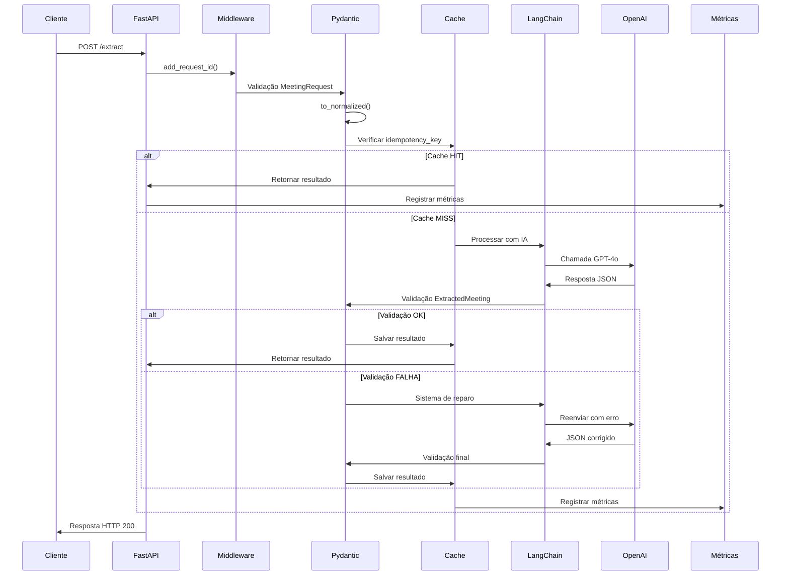
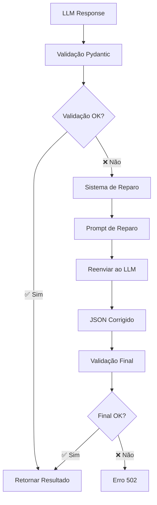
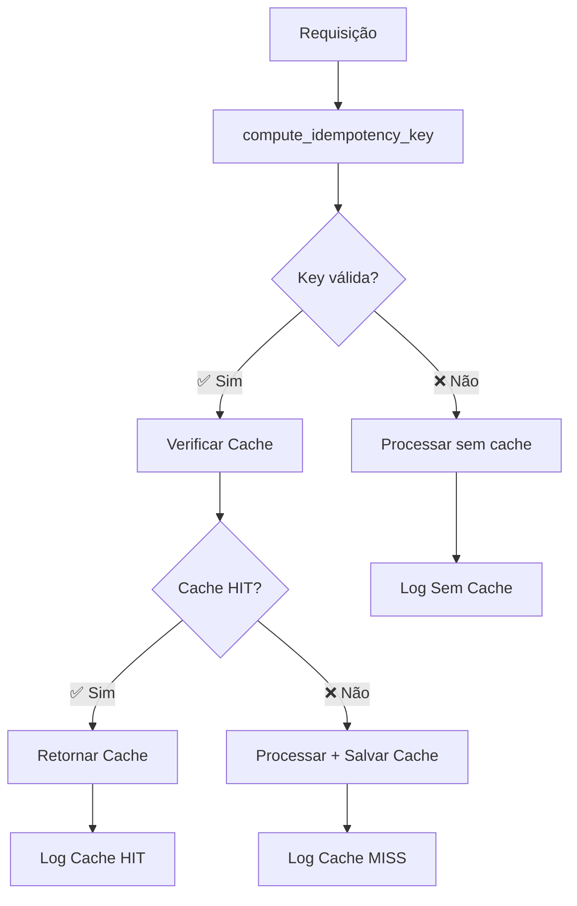
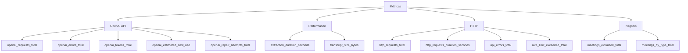
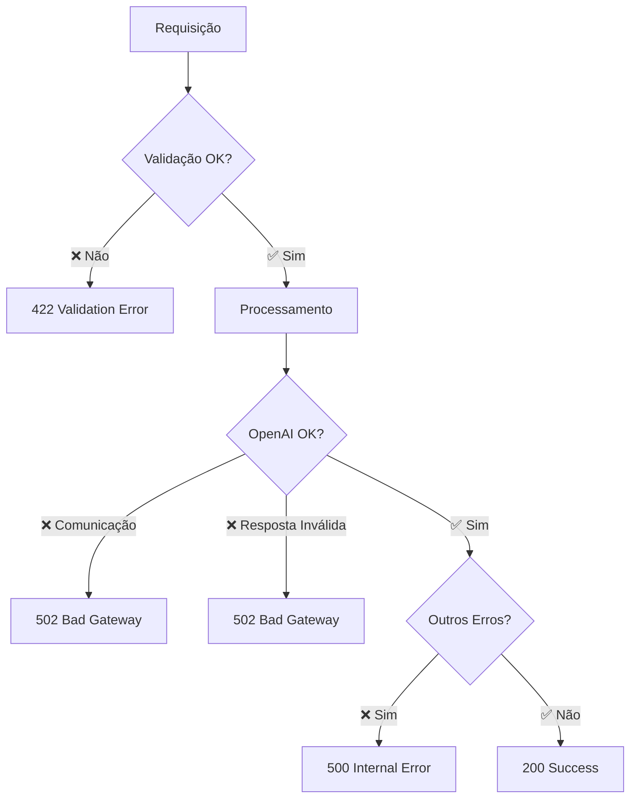
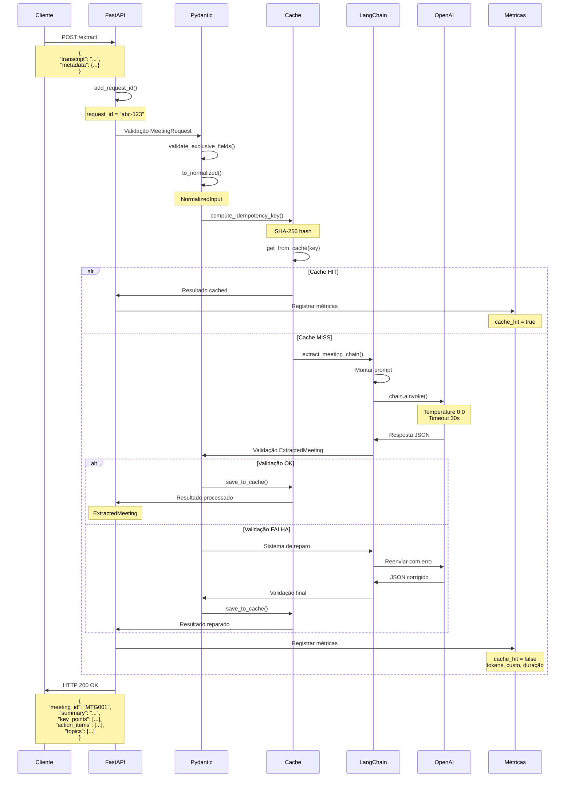
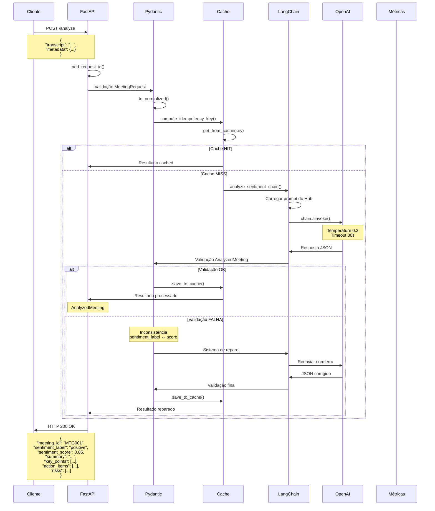

# 🎯 FLUXO COMPLETO END-TO-END - Meeting Processor

## 📋 Índice

1. [Visão Geral](#visão-geral)
2. [Arquitetura do Sistema](#arquitetura-do-sistema)
3. [Fluxo Visual Completo](#fluxo-visual-completo)
4. [Modelos Pydantic](#modelos-pydantic)
5. [Processamento LangChain](#processamento-langchain)
6. [Sistema de Cache](#sistema-de-cache)
7. [Métricas e Observabilidade](#métricas-e-observabilidade)
8. [Tratamento de Erros](#tratamento-de-erros)
9. [Fluxos de Dados Detalhados](#fluxos-de-dados-detalhados)
10. [Exemplos Práticos](#exemplos-práticos)

---

## 🎯 Visão Geral

Este documento apresenta um **fluxo visual completo end-to-end** do sistema Meeting Processor, desde a requisição HTTP até a resposta final, passando por todas as camadas de processamento, validação, cache e observabilidade.

### O que o Sistema Faz

O Meeting Processor é um microserviço que oferece **duas funcionalidades principais**:

1. **🔍 Extractor** - Extração de dados estruturados de transcrições
2. **🧠 Analyzer** - Análise de sentimento e geração de insights

### Tecnologias Principais

- **FastAPI** - Framework web assíncrono
- **Pydantic** - Validação de dados e serialização
- **LangChain** - Orquestração de LLMs
- **OpenAI API** - Processamento com GPT-4o
- **Prometheus** - Métricas e observabilidade
- **Cache em Memória** - Sistema de idempotência

---

## 🏗️ Arquitetura do Sistema

### Camadas Principais

```
┌─────────────────────────────────────────────────────────────┐
│                     CLIENTE HTTP                            │
│              (curl, Postman, frontend)                      │
└────────────────────┬────────────────────────────────────────┘
                     │
                     ↓
┌─────────────────────────────────────────────────────────────┐
│                CAMADA 1: API FASTAPI                        │
│                     (main.py)                               │
│  - Middleware: Request-ID, CORS                             │
│  - Validação automática (Pydantic)                         │
│  - Exception handlers (422, 502, 500)                      │
│  - 3 endpoints: /health, /extract, /analyze                │
└────────────────────┬────────────────────────────────────────┘
                     │
                     ↓
┌─────────────────────────────────────────────────────────────┐
│              CAMADA 2: VALIDAÇÃO E NORMALIZAÇÃO             │
│                (schemas_common.py)                          │
│  - MeetingRequest → NormalizedInput                         │
│  - Cálculo de idempotency_key (SHA-256)                    │
│  - Validação de exclusividade mútua (XOR)                  │
└────────────────────┬────────────────────────────────────────┘
                     │
                     ↓
┌─────────────────────────────────────────────────────────────┐
│                CAMADA 3: SISTEMA DE CACHE                   │
│                   (cache in-memory)                         │
│  - Verificação de idempotency_key                          │
│  - Cache HIT: retorna resultado instantâneo                │
│  - Cache MISS: continua processamento                      │
└────────────────────┬────────────────────────────────────────┘
                     │
                     ↓
┌─────────────────────────────────────────────────────────────┐
│              CAMADA 4: PROCESSAMENTO IA                     │
│            (extractor.py / analyzer.py)                     │
│  - LangChain: prompt + LLM + parser                        │
│  - OpenAI API: GPT-4o (temperature 0.0 ou 0.2)            │
│  - Retry automático (3 tentativas)                         │
│  - Sistema de reparo de JSON                               │
└────────────────────┬────────────────────────────────────────┘
                     │
                     ↓
┌─────────────────────────────────────────────────────────────┐
│              CAMADA 5: VALIDAÇÃO DE SAÍDA                   │
│         (schemas_extract.py / schemas_analyze.py)           │
│  - ExtractedMeeting / AnalyzedMeeting                       │
│  - Validação de consistência (sentiment_label ↔ score)     │
│  - Validação de summary (100-200 palavras)                 │
└────────────────────┬────────────────────────────────────────┘
                     │
                     ↓
┌─────────────────────────────────────────────────────────────┐
│                CAMADA 6: MÉTRICAS E LOGS                    │
│              (Prometheus + Logging)                         │
│  - Métricas de performance e custos                        │
│  - Logs estruturados com Request-ID                        │
│  - Rastreamento de tokens e custos                         │
└────────────────────┬────────────────────────────────────────┘
                     │
                     ↓
┌─────────────────────────────────────────────────────────────┐
│                     RESPOSTA HTTP                           │
│              JSON estruturado + headers                     │
└─────────────────────────────────────────────────────────────┘
```

---

## 🔄 Fluxo Visual Completo

### Fluxograma Principal

```mermaid
graph TD
    A[Cliente HTTP] --> B[POST /extract ou /analyze]
    B --> C[Middleware: Add Request-ID]
    C --> D[Validação Pydantic]
    D --> E{Validação OK?}
    E -->|❌ Não| F[422 Validation Error]
    E -->|✅ Sim| G[to_normalized()]
    G --> H[compute_idempotency_key()]
    H --> I[Verificar Cache]
    I --> J{Cache HIT?}
    J -->|✅ Sim| K[Retornar Cache]
    J -->|❌ Não| L[Processar com IA]
    L --> M[LangChain Chain]
    M --> N[OpenAI API]
    N --> O[Parse JSON]
    O --> P[Validação Pydantic]
    P --> Q{Validação OK?}
    Q -->|❌ Não| R[Sistema de Reparo]
    R --> S[Reenviar ao LLM]
    S --> T[Validação Final]
    Q -->|✅ Sim| T
    T --> U[Salvar no Cache]
    U --> V[Registrar Métricas]
    V --> W[Retornar Resultado]
    K --> X[Logs Estruturados]
    W --> X
    F --> X
    X --> Y[Resposta HTTP]
```

### Fluxo Detalhado por Componente



---

## 📋 Modelos Pydantic

### Hierarquia de Schemas

```mermaid
graph TD
    A[MeetingRequest] --> B{Formato de Entrada}
    B -->|Formato A| C[transcript + metadata]
    B -->|Formato B| D[raw_meeting]
    C --> E[to_normalized()]
    D --> E
    E --> F[NormalizedInput]
    F --> G{Endpoint}
    G -->|/extract| H[extract_meeting_chain]
    G -->|/analyze| I[analyze_sentiment_chain]
    H --> J[ExtractedMeeting]
    I --> K[AnalyzedMeeting]
```

### Schemas de Entrada

#### MeetingRequest (Validação Principal)
```python
class MeetingRequest(BaseModel):
    transcript: Optional[str] = None
    metadata: Optional[Metadata] = None
    raw_meeting: Optional[RawMeeting] = None
    
    @model_validator(mode='after')
    def validate_exclusive_fields(self):
        # XOR: exatamente UM formato
        has_transcript = self.transcript is not None
        has_raw = self.raw_meeting is not None
        if not (has_transcript ^ has_raw):
            raise ValueError("Forneça 'transcript' OU 'raw_meeting'")
        return self
```

#### NormalizedInput (Formato Interno)
```python
class NormalizedInput(BaseModel):
    transcript: str
    intent: Optional[Literal["extract", "analyze", "both"]] = None
    meeting_id: Optional[str] = None
    customer_id: Optional[str] = None
    customer_name: Optional[str] = None
    banker_id: Optional[str] = None
    banker_name: Optional[str] = None
    meet_type: Optional[str] = None
    meet_date: Optional[datetime] = None
    
    def compute_idempotency_key(self) -> Optional[str]:
        if not (self.meeting_id and self.meet_date and self.customer_id):
            return None
        base = f"{self.meeting_id}{self.meet_date.isoformat()}{self.customer_id}"
        return hashlib.sha256(base.encode("utf-8")).hexdigest()
```

### Schemas de Saída

#### ExtractedMeeting (Feature Extractor)
```python
class ExtractedMeeting(BaseModel):
    # Metadados obrigatórios
    meeting_id: str
    customer_id: str
    customer_name: str
    banker_id: str
    banker_name: str
    meet_type: str
    meet_date: datetime
    
    # Dados extraídos por IA
    summary: str  # 100-200 palavras
    key_points: List[str]
    action_items: List[str]
    topics: List[str]  # Campo específico do Extractor
    
    # Metadados de controle
    source: Literal["lftm-challenge"] = "lftm-challenge"
    idempotency_key: Optional[str] = None
    
    @field_validator("summary")
    def validate_summary_length(cls, summary: str) -> str:
        wc = len(summary.split())
        if wc < 100 or wc > 200:
            raise ValueError(f"summary deve ter 100-200 palavras, tem {wc}")
        return summary
```

#### AnalyzedMeeting (Feature Analyzer)
```python
class AnalyzedMeeting(BaseModel):
    # Metadados obrigatórios (mesmos do ExtractedMeeting)
    meeting_id: str
    customer_id: str
    customer_name: str
    banker_id: str
    banker_name: str
    meet_type: str
    meet_date: datetime
    
    # Análise de sentimento
    sentiment_label: Literal["positive", "neutral", "negative"]
    sentiment_score: float  # 0.0-1.0
    
    # Dados extraídos por IA
    summary: str  # 100-200 palavras
    key_points: List[str]
    action_items: List[str]
    
    # Insights específicos do Analyzer
    risks: List[str]  # Pode ser vazio []
    
    # Metadados de controle
    source: Literal["lftm-challenge"] = "lftm-challenge"
    idempotency_key: Optional[str] = None
    
    @model_validator(mode='after')
    def validate_sentiment_consistency(self):
        """Valida consistência label ↔ score"""
        label = self.sentiment_label
        score = self.sentiment_score
        
        if label == "positive" and score < 0.6:
            raise ValueError(f"positive requer score >= 0.6, recebido: {score}")
        elif label == "neutral" and not (0.4 <= score < 0.6):
            raise ValueError(f"neutral requer 0.4 <= score < 0.6, recebido: {score}")
        elif label == "negative" and score >= 0.4:
            raise ValueError(f"negative requer score < 0.4, recebido: {score}")
        
        return self
```

---

## ⚙️ Processamento LangChain

### Arquitetura LangChain

```mermaid
graph LR
    A[Prompt Template] --> B[LLM OpenAI]
    B --> C[JSON Parser]
    A --> D[Chain = Prompt | LLM | Parser]
    D --> E[ainvoke()]
    E --> F[Dict Python]
```

### Configuração por Feature

#### Extractor (Temperature 0.0)
```python
# Determinístico - dados estruturados precisos
llm = ChatOpenAI(
    model="gpt-4o",
    temperature=0.0,  # Sem aleatoriedade
    timeout=30.0
)

prompt = ChatPromptTemplate.from_messages([
    ("system", """Você é um assistente especializado em extrair informações 
    estruturadas de transcrições de reuniões bancárias.
    
    REGRAS IMPORTANTES:
    1. PRIORIDADE DOS METADADOS: Se fornecidos, USE-OS COMO VERDADE ABSOLUTA
    2. EXTRAÇÃO DA TRANSCRIÇÃO: Se metadados ausentes, extraia da transcrição
    3. CAMPOS SEMPRE EXTRAÍDOS: summary (100-200 palavras), key_points, action_items, topics
    4. VALIDAÇÕES: Não invente informações, não deixe campos vazios
    
    FORMATO DE SAÍDA:
    {
        "meeting_id": "string",
        "customer_id": "string", 
        "customer_name": "string",
        "banker_id": "string",
        "banker_name": "string",
        "meet_type": "string",
        "meet_date": "datetime",
        "summary": "string (100-200 palavras)",
        "key_points": ["string"],
        "action_items": ["string"],
        "topics": ["string"]
    }"""),
    
    ("human", """TRANSCRIÇÃO:
    {transcript}
    
    METADADOS FORNECIDOS:
    {metadata_json}
    
    Retorne o JSON extraído:""")
])

chain = prompt | llm | parser
```

#### Analyzer (Temperature 0.2)
```python
# Levemente criativo - análise de sentimento
llm = ChatOpenAI(
    model="gpt-4o",
    temperature=0.2,  # Criatividade controlada
    timeout=30.0
)

# Prompt carregado do LangChain Hub
prompt_hub_name = os.getenv("ANALYZER_PROMPT_HUB_NAME")
prompt = hub.pull(prompt_hub_name)

chain = prompt | llm | parser
```

### Sistema de Reparo



---

## 💾 Sistema de Cache

### Arquitetura do Cache



### Implementação do Cache

```python
# Cache global em memória
_cache: Dict[str, Tuple[dict, datetime]] = {}
CACHE_TTL_HOURS = 24

def get_from_cache(key: str) -> Optional[dict]:
    """Recupera dados do cache se ainda válidos."""
    if key not in _cache:
        return None
    
    result, timestamp = _cache[key]
    age_hours = (datetime.now() - timestamp).total_seconds() / 3600
    
    if age_hours > CACHE_TTL_HOURS:
        del _cache[key]  # Expira
        return None
    
    return result

def save_to_cache(key: str, data: dict, ttl_hours: int = CACHE_TTL_HOURS):
    """Salva dados no cache com TTL."""
    _cache[key] = (data, datetime.now())

def clear_cache():
    """Limpa todo o cache (útil para testes)."""
    _cache.clear()
```

### Fluxo de Cache nos Endpoints

```python
# No endpoint /extract e /analyze
async def extract_meeting(request: Request, body: MeetingRequest):
    request_id = request.state.request_id
    
    # 1. Normalizar input
    normalized = body.to_normalized()
    
    # 2. Verificar cache
    cache_key = normalized.compute_idempotency_key()
    if cache_key:
        cached_result = await get_from_cache(cache_key)
        if cached_result:
            logger.info(f"[{request_id}] Cache HIT: {cache_key[:16]}...")
            return cached_result
    
    # 3. Processar (cache MISS)
    logger.info(f"[{request_id}] Cache MISS: {cache_key[:16]}...")
    result = await extract_meeting_chain(normalized, request_id)
    
    # 4. Salvar no cache
    if cache_key:
        await save_to_cache(cache_key, result.model_dump())
        logger.info(f"[{request_id}] Cache SAVED: {cache_key[:16]}...")
    
    return result
```

---

## 📊 Métricas e Observabilidade

### Métricas Prometheus Implementadas



### Exemplo de Métricas

```python
# OpenAI Requests
openai_requests_total{model="gpt-4o", status="success"} 1247
openai_requests_total{model="gpt-4o", status="error"} 23

# Tokens e Custos
openai_tokens_total{type="prompt"} 456789
openai_tokens_total{type="completion"} 123456
openai_estimated_cost_usd{model="gpt-4o"} 12.45

# Performance
extraction_duration_seconds_bucket{le="1.0"} 234
extraction_duration_seconds_bucket{le="5.0"} 567
extraction_duration_seconds_bucket{le="10.0"} 789

# HTTP
http_requests_total{method="POST", endpoint="/extract", status_code="200"} 890
http_requests_total{method="POST", endpoint="/analyze", status_code="200"} 567
```

### Logs Estruturados

```python
# Padrão de logs
logger.info(f"[{request_id}] [TAG] Mensagem | contexto_key=valor")

# Exemplos de logs
[abc-123] [EXTRACT] Iniciando extração | transcript_len=790 | has_metadata=sim
[abc-123] [RESPONSE] LLM respondeu | duration=3.2s | output_keys=[...]
[abc-123] [SUCCESS] Extração concluída | meeting_id=MTG001 | summary_words=169
[abc-123] [CACHE] Cache HIT | key=7e3e97ffd83f...
[abc-123] [IDEM] Idempotency key calculada | key=7e3e97ffd83f...
```

---

## 🚨 Tratamento de Erros

### Códigos de Status HTTP



### Tipos de Erros

#### 422 - Validation Error
```json
{
  "error": "validation_error",
  "message": "Dados de entrada inválidos",
  "details": [
    {
      "loc": ["body"],
      "msg": "Forneça 'transcript' OU 'raw_meeting', não ambos",
      "type": "value_error"
    }
  ],
  "request_id": "abc-123"
}
```

#### 502 - OpenAI Communication Error
```json
{
  "error": "openai_communication_error",
  "message": "Erro ao comunicar com OpenAI API (timeout, rate limit...)",
  "error_type": "RateLimitError",
  "request_id": "abc-123"
}
```

#### 502 - OpenAI Invalid Response
```json
{
  "error": "openai_invalid_response", 
  "message": "OpenAI retornou dados inválidos ou incompletos",
  "request_id": "abc-123"
}
```

#### 500 - Internal Error
```json
{
  "error": "internal_error",
  "message": "Erro interno ao processar a requisição",
  "request_id": "abc-123"
}
```

---

## 🔄 Fluxos de Dados Detalhados

### Fluxo Completo - Feature Extractor



### Fluxo Completo - Feature Analyzer



---

## 🎓 Exemplos Práticos

### Exemplo 1: Extração Bem-Sucedida (Cache MISS)

**Requisição:**
```bash
curl -X POST http://localhost:8000/extract \
  -H "Content-Type: application/json" \
  -d '{
    "transcript": "Cliente: Olá, preciso de um empréstimo de R$ 500 mil para capital de giro. Banker: Perfeito! Vou preparar uma proposta personalizada.",
    "metadata": {
      "meeting_id": "MTG-2025-001",
      "customer_id": "CUST-456",
      "meet_date": "2025-09-10T14:30:00Z"
    }
  }'
```

**Logs:**
```
[abc-123] POST /extract | format=transcript+metadata
[abc-123] Input normalizado | transcript_len=156 | has_metadata=sim
[abc-123] [CACHE] Cache MISS | key=7e3e97ffd83f...
[abc-123] [EXTRACT] Iniciando extração | has_metadata=sim
[abc-123] [RESPONSE] LLM respondeu | duration=3.2s | output_keys=[...]
[abc-123] [SUCCESS] Validação Pydantic OK
[abc-123] [CACHE] Cache SAVED | key=7e3e97ffd83f...
[abc-123] [SUCCESS] Extração concluída | meeting_id=MTG-2025-001 | summary_words=169
```

**Resposta:**
```json
{
  "meeting_id": "MTG-2025-001",
  "customer_id": "CUST-456",
  "customer_name": "Cliente não identificado",
  "banker_id": "unknown",
  "banker_name": "Banker não identificado",
  "meet_type": "Empréstimo",
  "meet_date": "2025-09-10T14:30:00Z",
  "summary": "Reunião focou na solicitação de empréstimo de capital de giro no valor de R$ 500 mil. O cliente demonstrou necessidade financeira clara e o banker se mostrou receptivo à proposta, comprometendo-se a preparar uma solução personalizada. A conversa foi direta e objetiva, com foco na análise das necessidades do cliente e na estruturação de uma proposta adequada às suas demandas de capital de giro.",
  "key_points": [
    "Cliente solicitou empréstimo de R$ 500 mil para capital de giro",
    "Banker demonstrou receptividade à proposta",
    "Compromisso de preparar proposta personalizada"
  ],
  "action_items": [
    "Preparar proposta de empréstimo personalizada",
    "Analisar capacidade de pagamento do cliente"
  ],
  "topics": [
    "Empréstimo",
    "Capital de Giro",
    "Proposta Personalizada"
  ],
  "source": "lftm-challenge",
  "idempotency_key": "7e3e97ffd83f47c1556889a2b1e4d7f6a8b9c0d1e2f3a4b5c6d7e8f9a0b1c2d3",
  "transcript_ref": null,
  "duration_sec": null
}
```

### Exemplo 2: Análise de Sentimento (Cache HIT)

**Requisição (mesma reunião):**
```bash
curl -X POST http://localhost:8000/analyze \
  -H "Content-Type: application/json" \
  -d '{
    "transcript": "Cliente: Olá, preciso de um empréstimo de R$ 500 mil para capital de giro. Banker: Perfeito! Vou preparar uma proposta personalizada.",
    "metadata": {
      "meeting_id": "MTG-2025-001",
      "customer_id": "CUST-456",
      "meet_date": "2025-09-10T14:30:00Z"
    }
  }'
```

**Logs:**
```
[def-456] POST /analyze | format=transcript+metadata
[def-456] Input normalizado | transcript_len=156 | has_metadata=sim
[def-456] [CACHE] Cache HIT | key=7e3e97ffd83f...
[def-456] [SUCCESS] Análise concluída | sentiment=positive | score=0.85
```

**Resposta:**
```json
{
  "meeting_id": "MTG-2025-001",
  "customer_id": "CUST-456",
  "customer_name": "Cliente não identificado",
  "banker_id": "unknown",
  "banker_name": "Banker não identificado",
  "meet_type": "Empréstimo",
  "meet_date": "2025-09-10T14:30:00Z",
  "sentiment_label": "positive",
  "sentiment_score": 0.85,
  "summary": "Reunião com sentimento positivo, focando na solicitação de empréstimo de capital de giro. O cliente demonstrou clareza em suas necessidades financeiras, enquanto o banker mostrou-se receptivo e proativo ao comprometer-se com uma proposta personalizada. A comunicação foi fluida e direta, indicando uma relação de confiança estabelecida desde o início da conversa.",
  "key_points": [
    "Cliente demonstrou clareza em suas necessidades",
    "Banker mostrou-se receptivo e proativo",
    "Relação de confiança estabelecida"
  ],
  "action_items": [
    "Preparar proposta de empréstimo personalizada",
    "Manter comunicação próxima com o cliente"
  ],
  "risks": [],
  "source": "lftm-challenge",
  "idempotency_key": "7e3e97ffd83f47c1556889a2b1e4d7f6a8b9c0d1e2f3a4b5c6d7e8f9a0b1c2d3"
}
```

### Exemplo 3: Erro de Validação (422)

**Requisição Inválida:**
```bash
curl -X POST http://localhost:8000/extract \
  -H "Content-Type: application/json" \
  -d '{
    "transcript": "Cliente: Olá...",
    "raw_meeting": {
      "meet_id": "MTG001",
      "meet_transcription": "Cliente: Olá..."
    }
  }'
```

**Logs:**
```
[ghi-789] POST /extract | format=transcript+metadata
[ghi-789] Validation error | errors=[{'loc': ['body'], 'msg': 'Forneça transcript OU raw_meeting, não ambos', 'type': 'value_error'}]
```

**Resposta:**
```json
{
  "error": "validation_error",
  "message": "Dados de entrada inválidos",
  "details": [
    {
      "loc": ["body"],
      "msg": "Forneça 'transcript' OU 'raw_meeting', não ambos nem nenhum",
      "type": "value_error"
    }
  ],
  "request_id": "ghi-789"
}
```

### Exemplo 4: Sistema de Reparo em Ação

**Cenário:** LLM retorna summary muito curto (50 palavras)

**Logs:**
```
[jkl-012] [EXTRACT] Iniciando extração | transcript_len=523
[jkl-012] [RESPONSE] LLM respondeu | duration=4.1s
[jkl-012] [VALIDATION] Validação falhou | erro=summary deve ter 100-200 palavras, tem 50
[jkl-012] [REPAIR] Tentando reparar JSON | erro=summary deve ter 100-200 palavras, tem 50
[jkl-012] [REPAIR] JSON reparado com sucesso
[jkl-012] [SUCCESS] Validação OK após reparo
[jkl-012] [SUCCESS] Extração concluída | summary_words=152
```

---

## 📊 Resumo dos Componentes

### Arquivos Principais

| Arquivo | Responsabilidade | Linhas | Funcionalidade |
|---------|------------------|--------|----------------|
| `main.py` | API FastAPI, endpoints, middleware | ~678 | Porta de entrada, validação, tratamento de erros |
| `schemas_common.py` | Schemas compartilhados | ~391 | Validação de entrada, normalização, idempotência |
| `schemas_extract.py` | Schema do Extractor | ~146 | Validação de saída da extração |
| `schemas_analyze.py` | Schema do Analyzer | ~136 | Validação de saída da análise |
| `extractor.py` | Feature Extractor | ~541 | Extração com IA (temperature=0) |
| `analyzer.py` | Feature Analyzer | ~322 | Análise de sentimento (temperature=0.2) |

### Endpoints Disponíveis

| Endpoint | Método | Feature | Propósito | Cache |
|----------|--------|---------|-----------|-------|
| `/health` | GET | - | Health check | ❌ |
| `/extract` | POST | Extractor | Extração de dados estruturados | ✅ |
| `/analyze` | POST | Analyzer | Análise de sentimento | ✅ |

### Fluxo de Dados

```
Cliente → FastAPI → Pydantic → Cache → LangChain → OpenAI → Validação → Cache → Resposta
```

### Tecnologias e Versões

| Tecnologia | Versão | Uso |
|------------|--------|-----|
| FastAPI | 0.115.0 | Framework web |
| Pydantic | 2.9.2 | Validação de dados |
| LangChain | 0.3.2 | Orquestração de LLMs |
| OpenAI | 1.47.0 | SDK da OpenAI |
| Prometheus | 0.20.0 | Métricas |

---

## 🔗 Navegação

### Documentos Relacionados

- **[01-OVERVIEW.md](01-OVERVIEW.md)** - Visão geral do sistema
- **[02-SCHEMAS.md](02-SCHEMAS.md)** - Detalhes dos schemas Pydantic
- **[03-EXTRACTOR.md](03-EXTRACTOR.md)** - Implementação do Extractor
- **[04-ANALYZER.md](04-ANALYZER.md)** - Implementação do Analyzer
- **[05-MAIN-API.md](05-MAIN-API.md)** - Documentação da API
- **[06-METRICS.md](06-METRICS.md)** - Métricas Prometheus
- **[07-TESTS.md](07-TESTS.md)** - Guia de testes
- **[08-CACHE.md](08-CACHE.md)** - Sistema de cache

### Próximos Passos

1. **Implementar Redis** - Cache distribuído
2. **Adicionar Autenticação** - API Keys ou JWT
3. **Dashboard Grafana** - Visualização de métricas
4. **CI/CD Pipeline** - Deploy automático
5. **Banco de Dados** - Persistência de resultados

---

**Última atualização:** 2025-10-13  
**Versão:** 2.0.0  
**Status:** ✅ Produção (2 features completas: Extractor + Analyzer)
